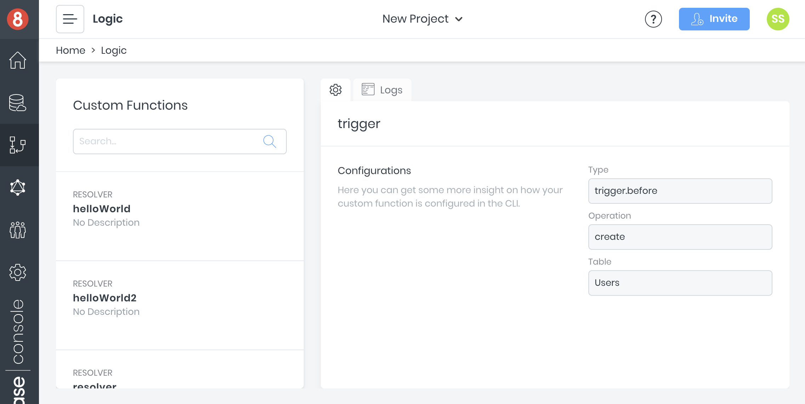

# Logic
The [Logic](https://app.8base.com/logic) screen is a dashboard where all [Custom Functions](https://docs.8base.com/docs/8base-console/custom-functions) that have been deployed to a workspace can be reviewed. Consider it your catalog for any custom server side logic.

## Custom Function Cards
Once custom functions have been deployed to a workspace, they will appear in a list on the left side of the Logic screen. Selecting a function will display the function's details on a card to the right of the functions list.

Function details include its `type`, `description` and relevant meta-data (configurations). Most importantly, clicking on the `Logs` tab will display the functions production logs.

## Logs
Logs can tailed – watched in real time – and searched. To turn on tailing, turn on the "Real Time Logs" toggle. You'll see a prompt on-screen that a connection is/has been established.

Keep in mind that when watching the logs a short latency period can be expected. Every request made is assigned a unique ID that can be used to search and identify a single request. 

If a `console.log('...something')` statement is used inside of a custom function, the printed result will appear here inside the logs.

## Descriptions and Meta Data
All descriptions and meta-data attributed to a function must be added/updated inside the `8base.yml` file. There is currently no support for editing functions in the management console.

Check out the [8base.yml docs](https://docs.8base.com/docs/development-tools/dev-env/8base-yml) to learn more about deploying functions to a workspace.