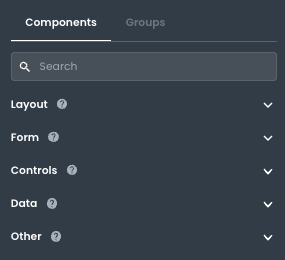

# Component Categories

This article describes the different component categories available in App Builder.

___

In App Builder, the Component Library has five sections. Each section contains different types of components. These groupings are solely for organizational purposes and may change in the future.

**Layout Components** - Various types of container components. 

**Form Components** - Various types of form inputs and the form block component.

**Control Components** - Various types of input components.

**Data Components** - Various types of data-centric components.

**Other Components** - All other components.

Each component category has a unique icon to help you quickly identify the type of component. In the future, we may add more organizational structures, such as tagging, to help you find the right component faster. 

The Component Library will continue to grow over time. We welcome your feedback on how we can further improve it.
