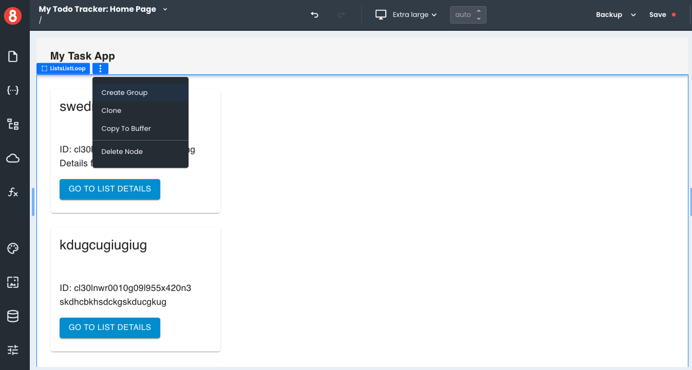

# Component Groups

This article describes how developers can use Component Groups to group together components into a reusable object.

___

Component Groups are a way of logically grouping together components in an app. This is useful for several reasons:

- It allows developers to reuse components across multiple apps.
- It makes it easier to manage large numbers of components.

To create a Component Group, add any number of Components to the Page Canvas, just as you would when developing a normal app Page. Once you have added all the Components you want to include in the Group, select the outermost container and click vertical elipsis next to the Component name tag. In the dropdown, click the "Create Group" option.

Once a Group is created, it will appear  in the Components "Group" Tab with a special icon to indicate that it is a Group. You can drag-and-drop the Group onto the Page Canvas to use it just like any other Component.

If you need to make changes to a Group, simply edit an existing instance of the Group and then create a new Group. **Changes made to a Group do not propagate across all instances of that Group.**