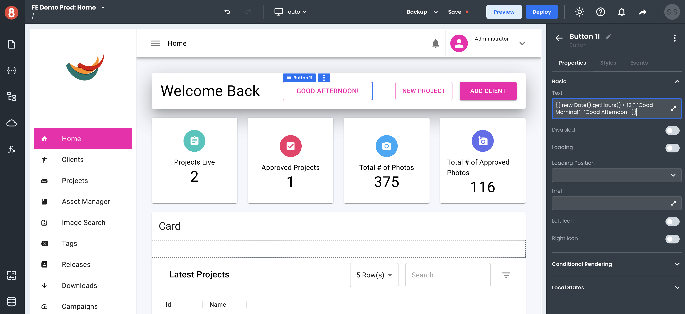
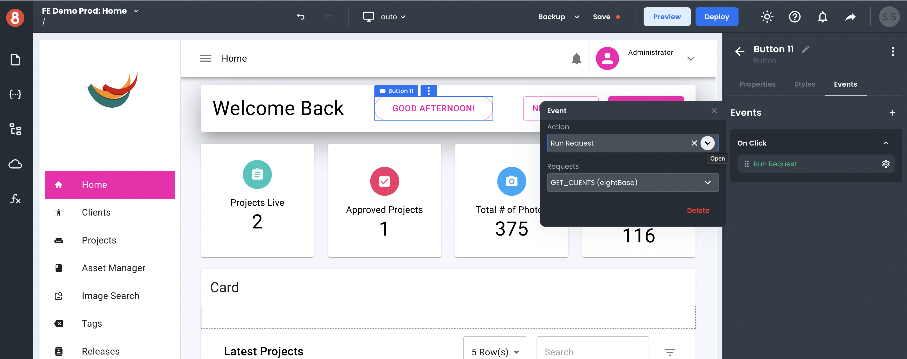

# Customizing App Builder Components
This article describes how a developer can customize and configure App Builder components.

___

When working with Components in App Builder, there are 3 areas of configuration and customization that you have access to. They are **properties**, **styles**, and **events**.

## Component Properties  

You can set Component properties to affect the behavior of a component and its data. For example, you can set the "isLoading" property of a Button component to true to make the button disabled and display a loading spinner instead of the button's label. You can also set properties in the Component Settings area of the Editor. 

Most inputs are Handlebars enabled, meaning that you can write expressions and use functions inside the inputs to determine values. For example, you can get a greeting message on a Text component to be `{{ new Date().getHours() < 12 ? "Good Morning!" : "Good Afternoon!" }}` to dynamically render a time-sensitive (get it) message to your user.

## Component Styles 

You can also use the Styles pane to update the appearance of a Component. For example, you can change the background color, font size, and padding of a Button component. Styles changes will immediately be reflected on the rendered Component so that you can see exactly what your Component will look like before you save any changes. 

App Builder also provides several different ways to customize the look and feel of your Components. You can use the built-in themes or create your custom themes. You can also use the CSS Editor to style your Component's styling pane directly. This gives you full control over how your Component looks and feels.

## Component Events

You can add event listeners to components in the Component Settings area of the Editor. Click on the "+" icon button in the "Events" tab of the Component Settings and select the event you want to trigger an Action on. You can then choose what action to take when that event is triggered. For example, you can navigate to a different page when a button is clicked, or you can run custom Javascript code. 

Adding event listeners is a quick and easy way to add interactivity to your components without writing any – or not too much – code. This makes creating UIs that are interactive and responsive to user input easy. 

## Next Steps

In the following sections, we'll take a deeper look at each type of configuration.
