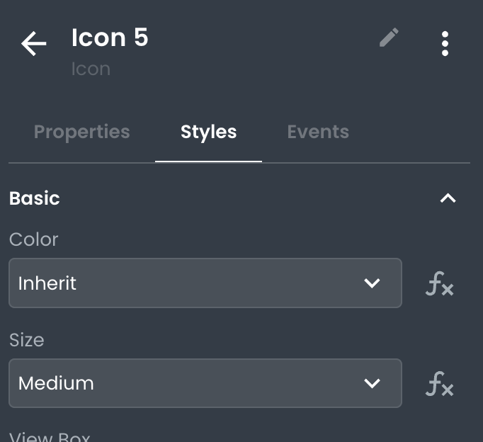
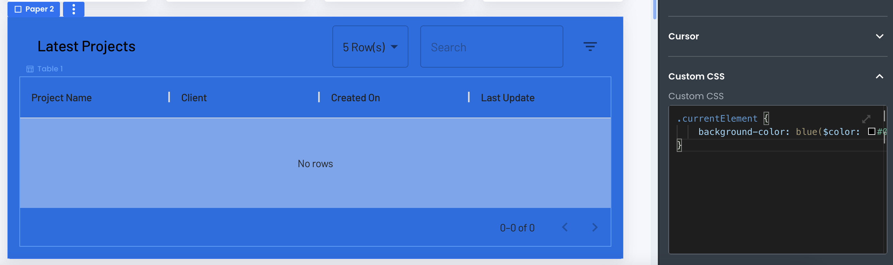

# Customizing Styling on Components

This article describes how a developer can apply custom styling to component instances when working with App Builder.

___


Every component in App Builder can be styled using the styling pane. Unlike when configuring your application Theme, component styles apply to the instance they're being set on.  You can use this to make a specific component stand out or to override the theming for just one component. 

The default components that ship with App Builder are all based on an implementation of Material UI. As a result, some have custom styling properties specific to that framework. All custom styling options that are **unique to a component** appear at the top of the styling pane. 



All other styles supported by the underlying HTML elements will appear below in a relevant categorical grouping, such as **spacing**, **size**, **grid child**, and others. This allows you to leverage a form-based approach to styling your components using native web styling properties (i.e. padding, margin, font-size, etc.)

## Applying Custom CSS to Components

Styles can also be applied to components using CSS class. At the bottom of the Styles pane is a Custom CSS input in which a special CSS rule for `.currentElement` is prepopulated. Any style declarations added to this CSS rule will only apply to the current instance.



## Styling Components using Classes

Inside the Theme section of your app, you can add global custom CSS. You can use this CSS to target any component in your application. For example, if you wanted to set a global style for adding a red background to specific components, you could add the following CSS rule:

```css
.bg-red {
  background-color: red;
}
```

Using the **class** property on a component, you  can add the `.bg-red` class to any component you want to target with this rule:

## Conclusion

Customizing the style of components in App Builder is a powerful way to optimize the look and feel of your application. Utilizing the built-in styling properties unique to each component and custom CSS allows for a wide range of possibilities for making your app look just right.
