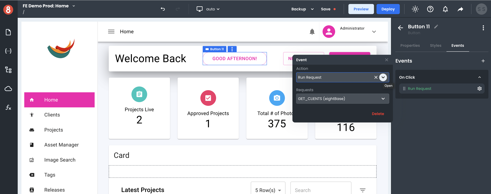

# Setting Event Listeners on Components

This article describes how developers can set Event Listeners on their Components when working in App Builder.

___

Events (event listeners) allow developers to specify functions, requests, scripts, or other actions that will be called automatically when a user interacts with a UI element. This allows developers to run their own actions in response to events triggered by the user. 

## Global Default Events

App Builder lets developers set event listeners on Components in the **Events** section of the Component's **Settings** (see screenshot above). Every component allows for the following event listeners to be set:

• **On Click**  -  Triggered when the user clicks on the element.

• **On Mouse Over** -  Triggered when the user's mouse enters the element.

• **On Mouse Out** - Triggered when the user's mouse leaves the element.

• **On Mouse Down** -  Triggered when the user presses down on the element.

• **On Mouse Up** - Triggered when the user releases the element.

• **On Mouse Enter** -  Triggered when the user's mouse enters the over the element.

• **On Mouse Leave** - Triggered when the user's mouse moves off the element.

• **Mouse Wheel** - Triggered when the user scrolls up or down while the mouse is over an element.

• **Context** -   Triggered when the user right-clicks on an element.

• **Aux Click** -  Triggered when the user middle-clicks on an element.

## Global Default Input Events

App Builder also allows for the following input event listeners to be set on Components:

• **On Change** - Triggered when the value of a form element (input, select, etc) is changed by the user.

• **Validate** -  Triggered when the user attempts to submit a form. 

## Form Block `On Submit` Event

The **On Submit** event is available for Form Blocks only. This event fires when the user clicks the submit button on a Form Block. 

• **On Submit** -  Triggered when the user submits a form.

## Event Actions

Every event listener set in App Builder is associated with an Action. An Action is a thing that will happen when the associated event is triggered by a user. 

Actions are set in the same place that Event Listeners are set: in the **Events** section of the Component's **Settings** (see screenshot below). There are currently 4 action types available to choose from.

• **Navigate** -  Go to another Screen or open a URL in the default web browser.

• **Run Function** -  Call a custom JavaScript function.

• **Run Request**  - Run a request.

• **Run Custom Code**  - Run a custom script.
