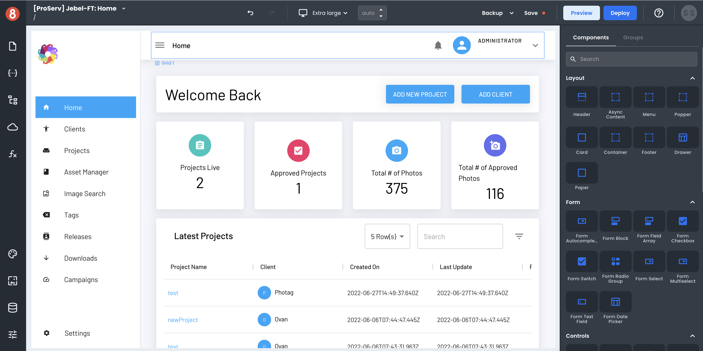
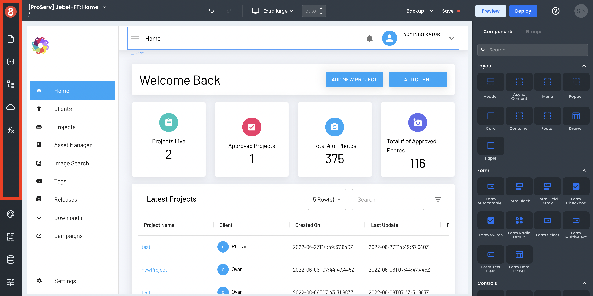
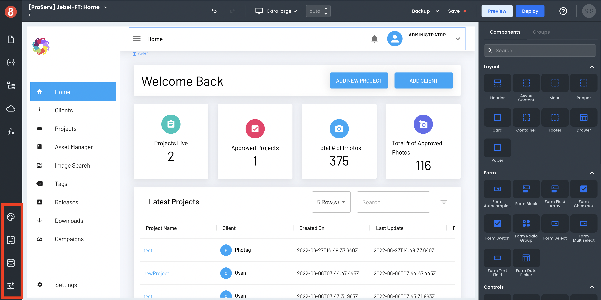
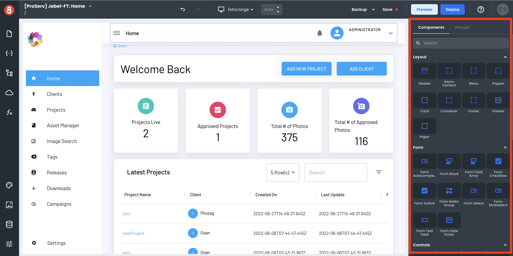
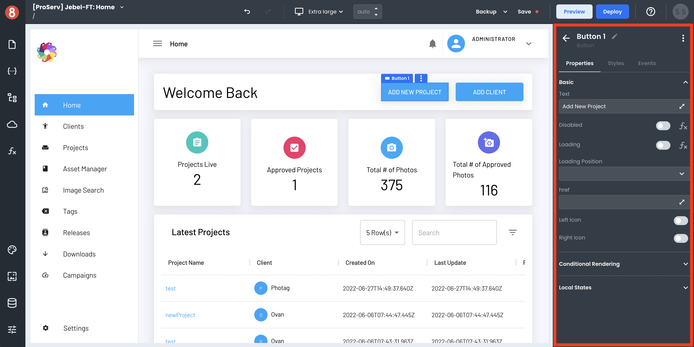

# Introduction

The App Builder Editor is a powerful tool for creating mobile applications. It offers a visual interface for designing your app and code editors for more advanced customization. In this article, we'll tour the App Builder Editor's anatomy and explore it, so you know how things get organized.

The App Builder Editor is divided into five main sections:

    • Header Menu
    • Page Context Menu
    • Settings, Assets, Resources, & Themes
    • Page Canvas
    • Components Drawer

## Header Menu

The Header Menu is intended for the following features/capabilities:

    • Back/redo button (undo/redo)
    • Viewport Selector (Mobile, Desktop, Tablet, etc.)
    • Backup Selector and Executor
    • Save
    • Preview
    • Deploy
    • Help
    • Account Avatar (Logout)

This area is mainly intended for general project-level actions and utilities during development, like save, undo, and redo. 

## Page Context Menu

The Page Context Menu is where you'll find all things relevant to the current page you're working on and some other things. These areas include:

    • Pages List & Settings 
    • State (Frontend Data)
    • Page Structure
    • Requests (API Calls)
    • Functions (Frontend Logic)

The default for any of these sections is to show the Local elements. However, these areas can be toggled to display the Global elements in any other state. 

## Settings, Assets, Resources, & Themes 

The Settings, Assets, Resources, and Themes area is where your most critical project-level settings can be accessed. This area is important for elements that are not specific to a particular page or component but more general and project-wide. Here you'll find in this area are: 

    • Theme (Global Styles)
    • Assets (Static Assets)
    • Resources (Data Sources)
    • App Settings

Each option opens full-page modals for their settings and configurations, except for Assets.

## Page Canvas 

The Page Canvas is strictly reserved for Components and building screens in a WYSIWYG drag and drop environment. It is the center of attention for most of the development process in App Builder. 

## Components Drawer 

The Components Drawer is where all available Components are displayed and where a Component Instance gets configured once added to the Page Canvas. 

When no Components are selected, the Component Library will be displayed here, along with a tab for Component Groups. Meanwhile, when a Component is selected, it will render the three configuration tabs: 

    • Properties
    • Styles
    • Events 

These configuration screens are where you'll spend the most time customizing the components' look, feel, and behavior. 

## Next Steps

By now, you should understand the App Builder Editor and where to find things. In the next section, we'll take a more in-depth look at each area.

