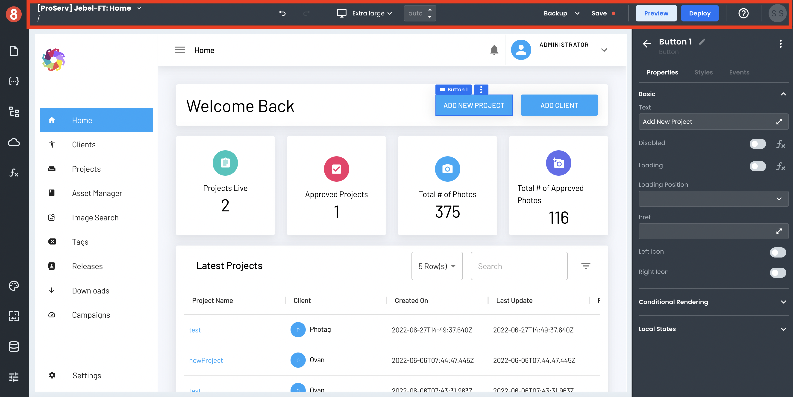
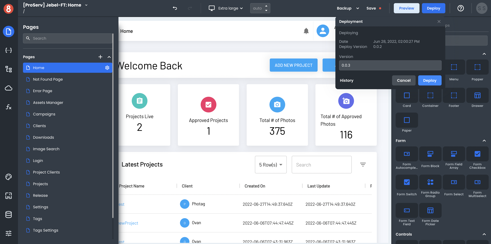
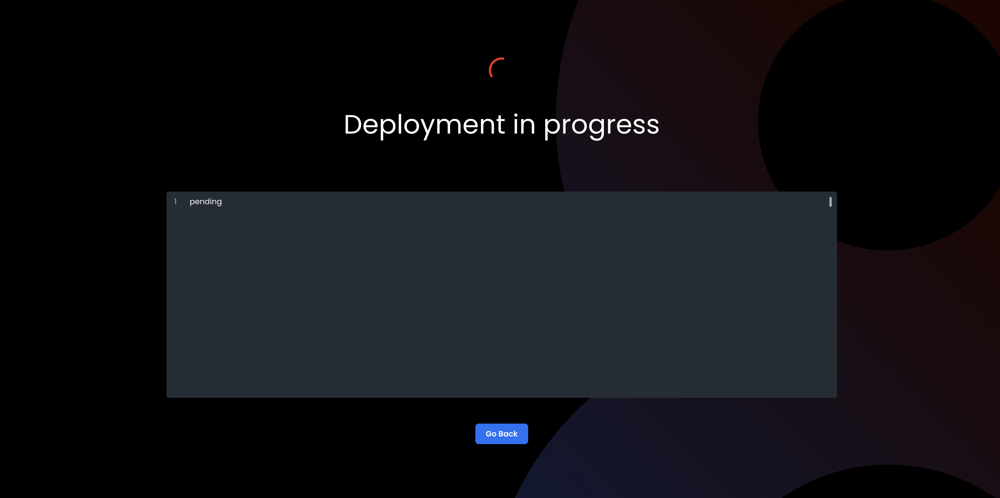

# Editor Header Menu Tools

When working inside the Editor, the Header Menu area is intended for the following features/capabilities:

## Back/redo button (undo/redo) 

The back button on the left allows you to undo your last change. The redo button on the right allows you to redo your last change. 

## Viewport Selector (Mobile, Desktop, Tablet, etc.)

The viewport selector allows you to change what device you're viewing your app on. This is helpful for seeing how your app will look on different devices or screensizes. 

Note that changing the viewport does not isolate the styling changes to that particular device. All changes made in the Editor will apply to all devices unless you use media queries or the element selector to target a specific device! 

You can read more about this in the media query docs (Coming soon...).

## Backup Selector and Executor

You are able to make a backup of your app at any time by clicking the "Backup" button. This will create a snapshot of your app as it currently exists so that you can always revert back to it. Using the drop-down selector located next to the backup button, you can choose which backup to revert to. 

## Save

The "Save" Button simply saves your work. You should use it often! If you don't save your work and reload the page, the app will revert back to your last change and will lose your progress. 

## Preview

If you want to see your app running in the browser, use the "Preview" button! This will open your app in the browser and display it as you'd expect for users. 

## Deploy
When you're ready to deploy your app, click on the "Deploy" button located in the top navigation bar of the App Builder editor. This will open a drop-down that shows your deployment history and allows you to click on the second "Deploy" button. Every new deployment is automatically assigned a version number that automatically increments. However, you have the ability to specify. However, you as the developer have the ability to manually specify it.

This will start the process of compiling, building, and deploying your app. All apps are automatically deployed to an S3 bucket. The bucket will be assigned a static URL that is mapped to it. 

## Help

If you need any help or support while using the App Builder, click on the "?" icon in the top navigation bar. This will open a modal with links to our documentation, support site, and feedback form. 

## Account Avatar (Logout)
The account avatar lets you log out.

