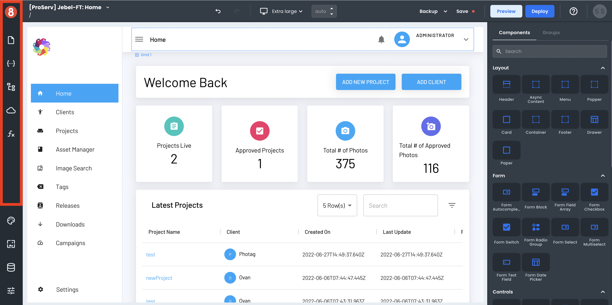

# Page Context Menu

The Page Context Menu is where you'll find all things relevant to the current page you're working on and some other things.

## Pages

The Pages tab is where you can add, delete, and reorder the pages in your app. You can also access page settings from here.

Any page settings are accessed by clicking on the gear icon to the right of the page name. This will open a side panel with the page settings, where you can update and delete pages.

## State (Frontend Data)

The State tab is where you can manage your app's frontend data. This is where you access, add, edit, and delete states.

For any element in App Builder, its local or global state can be accessed by opening the state pane and finding the element's name under its category group (i.e., Resource, Request, Component). 

Note that only "Custom Entries" can be edited. States for other elements other than Custom Entries can only be viewed and accessed.

## Page Structure

The Page Structure pane shows the hierarchy of components in a list. You can use this pane to re-organize the hierarchy of a page. This is useful if you want to change the order in which components are rendered on the page or find nested components and containers that may be visually hard to find in the application visually. 

Drag and drop a component from the Page Structure pane onto the canvas to use this feature. Conversely, you can also drag and drop components from the canvas into the Page Structure. This will change the parent-child relationship of the components and update the page accordingly. 

## Requests (API Calls)

Requests are where you create and manage the API calls for your app. This is where you access, add, edit, and delete requests.

To create an API request, click on the "+" button in the top-right corner of the Request modal.

In the Request create form, you can select which Resource you want to request and the different settings for that Request. The input variables, headers, and operation type can all be set. These options will vary based on the type of data source you're sending the Request to (e.g., GraphQL, REST, 8base Backend).

After you've made your Request, you'll see the response. The data also gets stored in the State pane, making it accessible by components and other parts of your app.

***

## Functions (Frontend Logic)

Functions in App Builder allow you to author and use Javascript functions locally and globally within your frontend app. They can be invoked from other parts of your app - for example, a button or an API call. 

Functions are found in the Page Context Menu under the 'Functions' tab. To create your first function, click the '+' button. A modal will appear where you can name your function, configure its settings, and begin writing code.

## Global vs. Local Elements

The default for any of these sections is to show the Local elements. This means that while a Local element can only be used on the page where it was created, a Global element can be used throughout your app - on every page.

