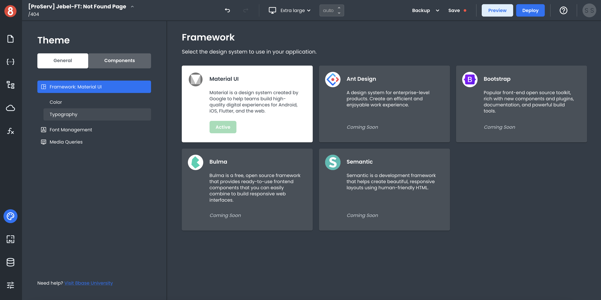
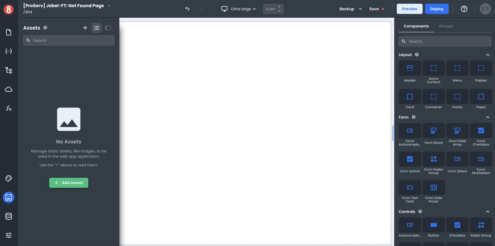
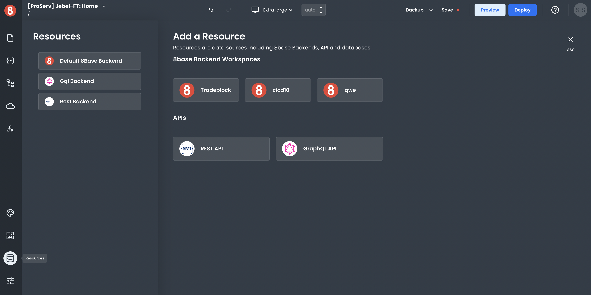
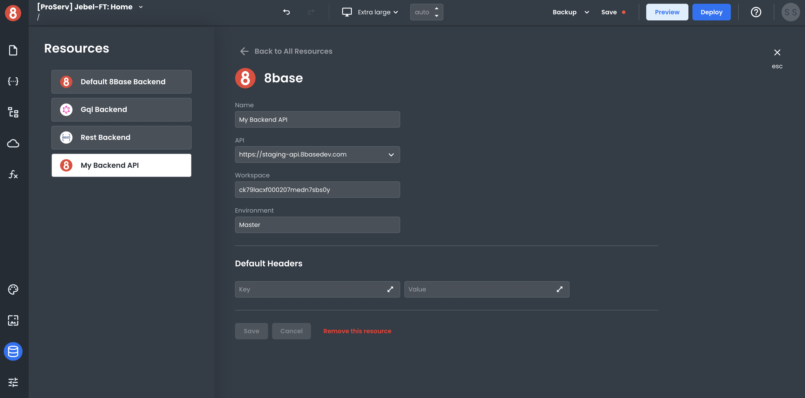
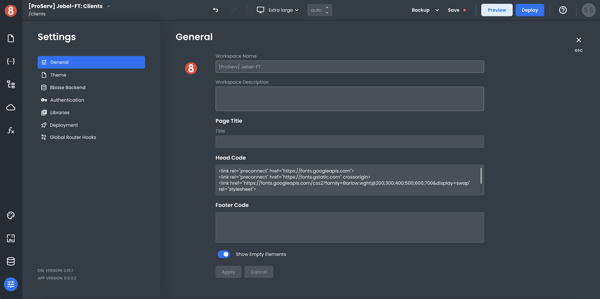

# Editor Settings and Global Context

The Settings, Assets, Resources, and Themes area is where your most critical project-level settings can be accessed. This area is important for elements that are not specific to a particular page or component but more general and project-wide. 

## Theme (Global Styles)

Your application Theme sets the default styling of your application. This includes things like colors, fonts, and component styles. The Theme area is where you can manage all the global styles for your app. 

By default, App Builder provides components that have been built using an implementation of Material UI. Due to this, Material UI is the default Theme CSS Design Framework. However, we'll be rolling out other CSS design frameworks over time. Meanwhile, you can go in and customize the default CSS associated with components and manage styling assets like fonts and media queries.

## Assets (Static Assets)

 

The Assets tab allows you to upload static images, videos, or document files. These can be used/displayed throughout your app using the relevant components. All document formats are currently supported.

Note that these files are **deployed with your app bundle.**

## Resources (Data Sources)

The Resources tab shows data sources you can send requests from your app to get data to your pages and interact with APIs. Think of each one as an API Client to quickly send requests. We currently support the following types of data sources:

- **REST API Client**: This allows you to connect to a REST API and get data from it. 

- **GraphQL API Client**: This allows you to connect to a GraphQL API and get data from it. 

- **8base Backend Client**: This allows you to connect to an 8base Backend easily.

### Configuring an 8base Backend Data Source

To set up a data source, click on the Resources icon in the left-side menu. It will open a modal that lists all of the available data sources. 

8base makes it easy to connect to an 8base Backend. In the "Add a Resource" area, click on any of your 8base Backends listed to set it up as a Resource. This will add it to your Resources list on the left modal area.

After your 8base Backend is selected, click on it in the list of the available resources. You'll then be able to choose the endpoint and environment (if connecting to a backend that has CI/CD) and set any default headers you want to send with requests.

## App Settings

The App Settings tab is where you'll configure general settings for your application that are not specific to any particular page, component, or data source.

This is where you can configure your app's name, description, 3rd party libraries, and more. Additionally, this is also where you'll be able to manage features like application deployment and global router hooks.

We'll cover all of this in more detail in upcoming sections.
