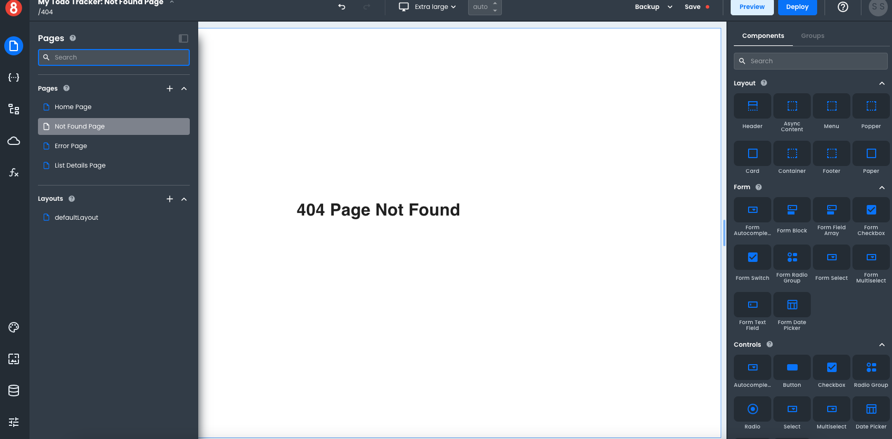

# 404 and Error Pages

This article describes how developers can use 404 and Error Pages.

---

By default, when a user navigates to a page that doesn't exist, they will see a 404 error page. This is because the App Builder does not know where to route the user. In order to fix this, developers need to add 404 and Error Pages to their app.

App Builder includes a 404 (Not Found Page) and Error Page by default in every project. A developer can style them however they want and add any additional functionality.

These pages are no different than any other pages in the app. If you want to create your own error pages, you can create them just like any other page and then navigate to them in the event of an error using `router.navigate.go("/error_page_path")`.

The 404 page is only special in that it's hard-wired to be displayed when the user navigates to a URL that doesn't exist. For example, if the user navigates to `/about`, but there is no `/about` page in the app, the 404 page will be displayed.

If you want to change this default behavior, you can intercept the 404 page in its `beforeRouteEnter` hook and redirect the user to another route that you prefer.
