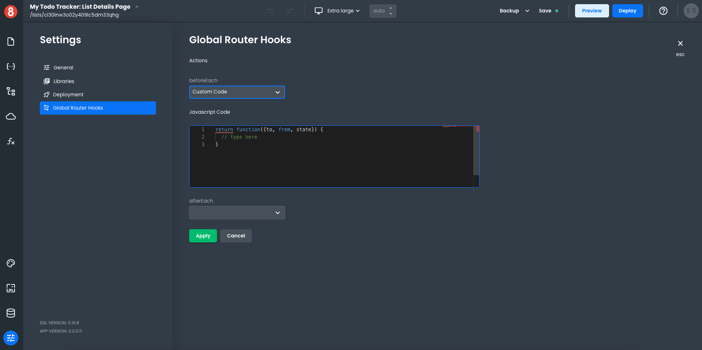
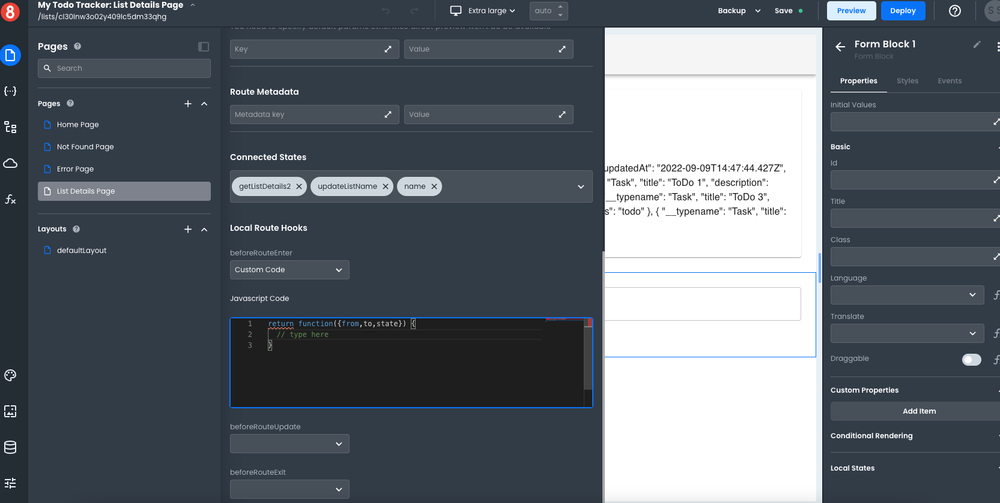

# Adding Logic to Navigation events

This article describes how developers add logic to navigation events.

___

Router Hooks allow developers to run Requests, Functions, or Router Function at different points during the routing life-cycle. 

A Router Function is almost like a transform on a Resource Request. However, it provides different arguments to the function for the developer to have access to:

```js
// ARGS
// **to**: the Route being navigated to with associated state and params.
// **from**: the Route being navigated away from with associated state and params.
// **state**: the state object local state object.
return function({from, to, state}) {
  // type here
}
```

>NOTE: The Router Function’s return value isn’t considered or evaluated.

The following Router Hooks are available at both the Global and Local.

### Global

Global router hooks get specified in the _Settings > Global Route Hooks_ of and App Builder project. They run on every Route transition unless the Route.



The available global hooks are:

- **beforeEach** - runs before any Route is entered.
- **afterEach** - runs after any Route is entered.

### Local

Local router hooks get specified in the Page Settings when editing a specific View. They run only when the associated Route is being navigated.



The available global hooks are:

- **beforeRouteEnter** - runs before the Route is entered.
- **beforeRouteUpdate** - runs before the Route is entered. For example, Route /users/:id is changed from /users/20 to /users/83.
- **beforeRouteExitLeave** - runs before the Route is left.
