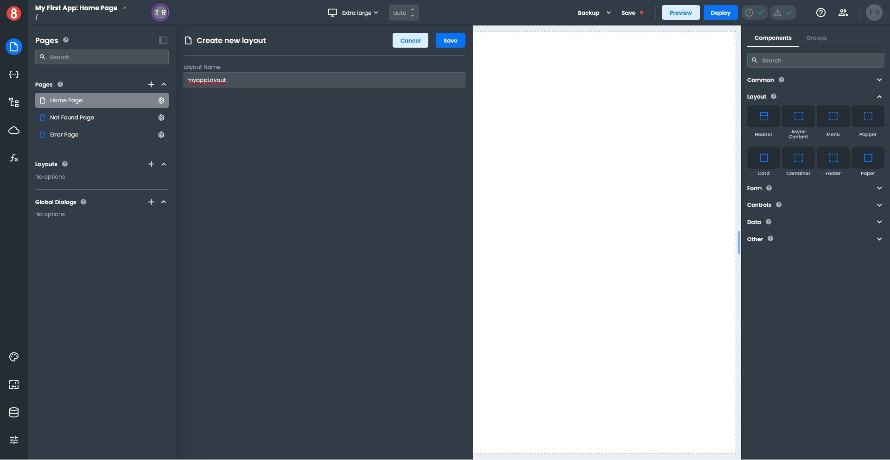
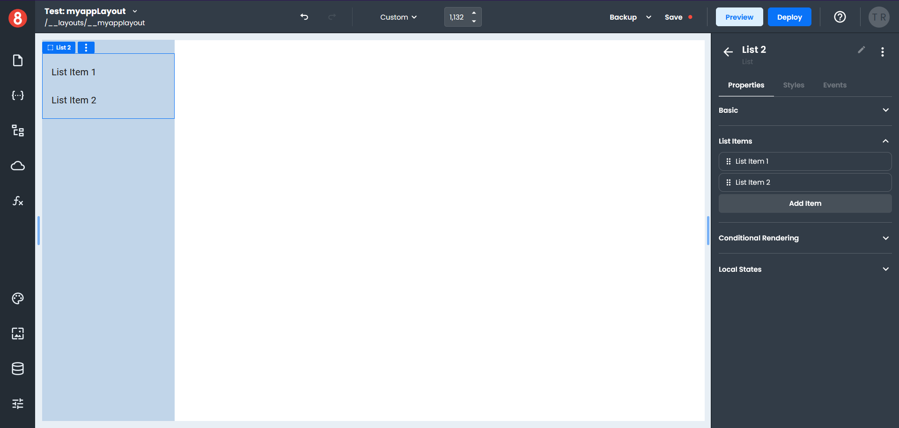
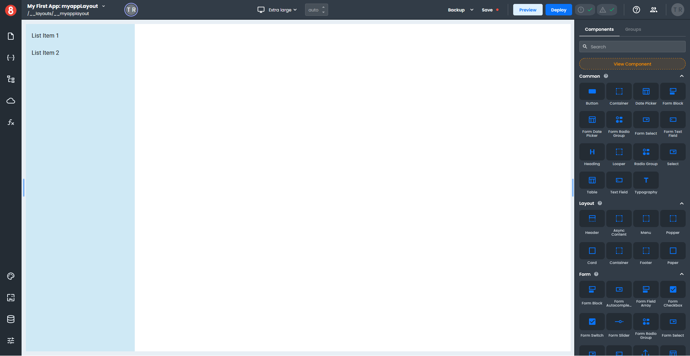
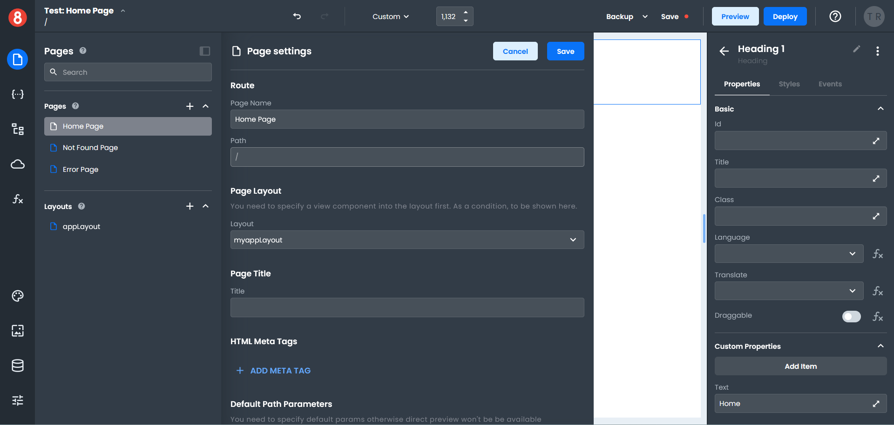
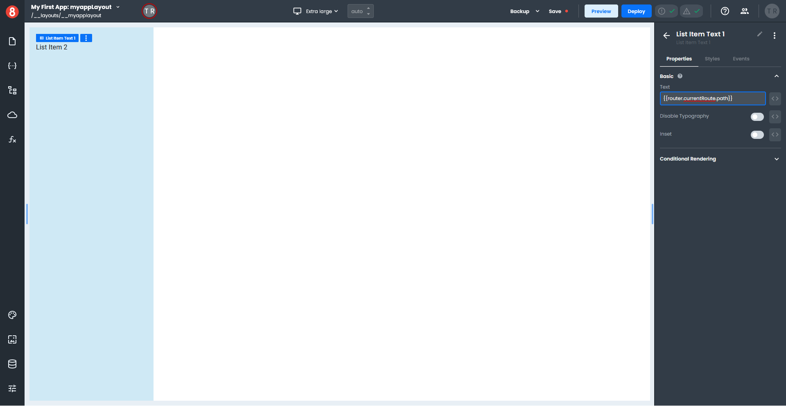
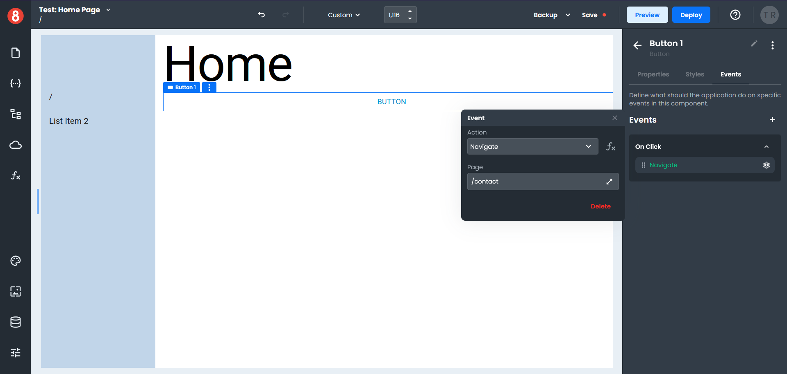

# How to create Layouts
*Layouts* are used to create common constructs for use in multiple pages.

We'll create a small example to demonstrate how to work with layouts. 

To create a new layout in the App Builder, click the plus button next to the *Layout* name in the *Pages* pane, and a fly-out panel will open. Enter the name of your layout and click "Save".

The name of your layout appears above the *Pages* pane and in the upper left corner of your canvas.

Click on the page icon in the left-hand tool bar; this will collapse the panel and expand the size of your canvas.

## Working with Layouts
Working in a layout is almost the same as working on a page, except for *View* components. A *View* component tells the application where in your layout to render pages.

### Adding Components to a Layout
You can add components to your *Layout* by dragging them from the right-hand *Components* menu onto your canvas.

The right-hand menu is context-sensitive and will switch depending on whether you are working with a *Layout* or a *Component*.

Drag a *Container* component onto the canvas and enter the name "menuContainer" in the field above the components menu.

Click on the canvas. This will highlight the layout name in blue indicating the layout is selected.

Click on the *Grid* icon in the *Styles* menu and enter the following. *Grid Template Columns:* 20% 80%, *Grid Template Rows:* none, *Grid Column Gap:* 15px.

Click in the left column on the canvas, to select the container component, and set a *Background* color in the *Styles* menu.

Click on the canvas outside the left column to switch the right-hand menu back to the *Components* menu.

In the *Search* type "list", this will display all the list components.

Drag a *List* component onto the left-hand column of the canvas.

Drag a *View* component onto the empty area of the canvas; this is where your pages will be displayed. *(If your View accidentally ends up on the left side of the canvas, just drag it to the right to reposition it.)*

Click on the *Page* icon in the left-hand tool bar to switch from Layouts to Pages.

Click on the *Home Page* item, which will load the page onto the canvas.

Locate the *Heading* component under the *Other* section and drag it onto the canvas. 

In the *Styles*, menu set the *Basic* Variant to H1.
Click on the *Properties* tab, and under *Custom Properties*, enter Home in the *Text* field.

### Adding a Layout to a Page

Continuing with our example, we need to set up the Home Page to use a layout.

Click the *Pages* icon on the left-hand tool bar, and then click on the *Gear* icon on the *Home Page* item.

In the *Page Settings* panel under *Page Layout*, select your layout from the Layout drop down, and click "Save". *(Only layouts in your App that have a View component are displayed in this list.)*

If you return to the Home Page, the page will now be displayed using your layout.

### Adding Data to a Layout
A Layout can access *Data* more specifically, it can access *Routes* for the page. 

Click on the *Pages* icon on the left-hand tool bar and select your Layout to switch to the Layout view. Then click on the *State* icon, which opens the *State* panel.

Under the *Routes* section, click on the small green arrow next to the "currentRoute" name to see a list of attributes. 

Hover to the right of the "path" attribute, which will display a clipboard icon. Click on the icon to copy the path to the clipboard.

Click on the *State* icon to collapse the *State* panel and return to the Layout view.

Select any *List Item* and click on the *Properties* tab in the right-hand menu. In the *Basic* section, paste the copied "path" attribute into the *Text* field. Add two brace brackets to the start and end of the "path" attribute.

The *List Item* you selected will not display anything in the Layout view, but if you switch to the *Page* view and select your *Home Page*, you will see the "path" displayed in your menu.

Click on the *Page* icon to return to the list, and then click on the *Gear* icon next to the *Contact* page; set the *Layout* to your current layout.

If you have not yet created a contact page, do that now.

### Testing a Layout
Let's add some navigation so we can test the layout.

Click on the *Page* icon and select the *Home Page*. In the *Components* menu, search for "button" and drag a button component onto your page.

Select the *Button* component on your page and click on the *Events* tab in the right-hand menu. Click the plus button to add an event and select an *On Click* event.

Click on the *Gear* icon next to the Action name and select *Navigate* from the drop-down menu. Enter "/contact" as the path in the *Page* field.

To preview the *Home Page* in a web browser, click on the *Preview* button in the top tool bar. 

Clicking the *Button* on the *Home Page* will take you to the *Contact* page. Notice the path for the contact page is displayed in the menu.

### Finishing Up
A Layout can access global objects like the router to access information within the page, which helps to create the dynamic aspects of your application.

 

