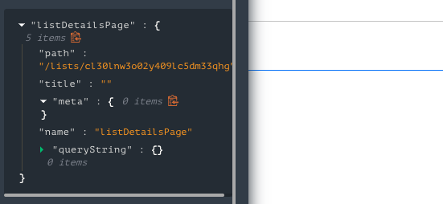

# Using Metadata Stored on Pages

This article describes how developers can use metadata stored on a Page.

___

In App Builder, the `router` is a global state entry provided to every page. On the currently active and all other routes, App Builder includes and makes available any metadata set in the Page Settings.



This makes it so that you can access `meta` for the current route in any function, request, or custom script.

```js
// Accessing the meta of a page from the router
var pageMeta = router[PAGE_NAME || "currentRoute"].fragments
``` 
