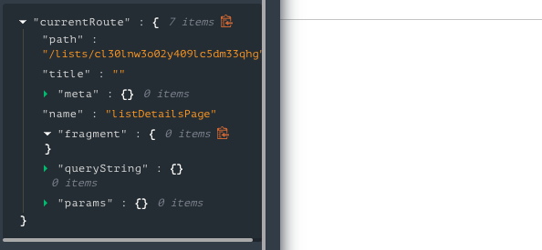

# Using URL Fragment Params

This article describes how developers use URL fragment parameters.

---

In App Builder, the `router` is a global state entry provided to every page. On the currently active route, App Builder parses and makes available any fragment params included in the URL path.



This makes it so that you can access `fragments` for the current route in any function, request, or custom script.

```js
// Accessing the fragments of the current page from the router
var urlFragments = router.currentRoute.fragments;
```
