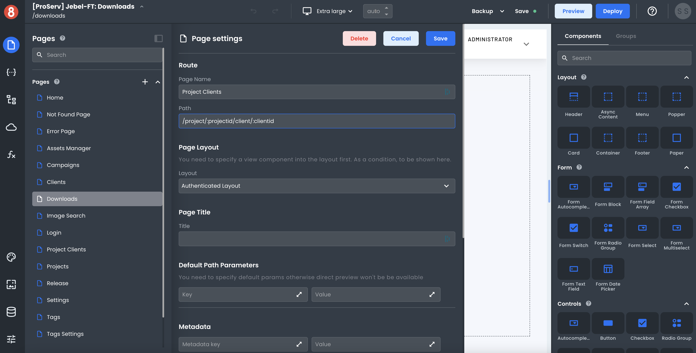

# Using URL Params

This document describes how developers can leverage URL parameters in their App Builder projects.

---

Dynamic URL parameters are when a URL's path contains a dynamic value. For example, in the following URL:

`http://www.example.com/users/123`

The value "123" would likely be a dynamic URL parameter for a path set to `/users/:id`. This kind of capability can be helpful when creating a single app Page that dynamically loads different data, think profiles for users, articles on a blog, or a specific task in a task management app.

## Setting a URL Param

In App Builder, developers can take advantage of dynamic URL parameters by declaring it in a Page's settings using the following notation.

`/static-param/:dynamic-param`

For example, in a blog app, you may want to dynamically load an article based on the article ID. In this case, your path for an Article page could look something like `/article/:articleId.` With this setup, when a user navigates to `/article/123`, the URL param `articleId` would be set to the value `123`.

To access this parameter in your code, you'll be able to find it in the Page's State.

## Things to Avoid

When using URL params, there are a few main things to avoid:

- **Don't use URL parameters for data that isn't dynamic.** This applies mostly when creating nested pages. For example, if you have an app with Pages for `/users` and `/articles`, it would be incorrect to set the path of an `/articles/:articleId` page to something like `/users/:userId/articles/:articleId`. The URL param `userId` in this case would never change because the Page is a child of the `/users` Page.

- **Don't use URL parameters at the root of a path. ** All dynamic parameters should have a static value in front of them. For example, the following paths `/:pageName` or `/:articleId` are not valid as they would end up being catch-all paths.

## Summary

Setting dynamic URL parameters in App Builder is a great way to create single-use pages that can load different data based on the value of a URL param. Keep in mind, however, to use URL parameters thoughtfully as misusing them could lead to issues down the road.
