# Creating and editing Layouts
This document describes how a developer can create and edit Layouts in the App Builder.
_____

## Introduction
When developing an application in the App Builder, you use *Layouts* and *Components* to build your pages. 

A *Layout* is a reusable container to arrange components on the Page Canvas. The App Builder has a few different Layouts, such as **Authenticated** and **Empty**. You can also create custom layouts.

A *Component* is a specific functionality you add to your layout or page. The App Builder has numerous pre-built components, such as **Menu**, **Header**, **Table**, **Date Picker**, **Icon**, and **Breadcrumbs**.

Every page in your application requires a layout. If you want a standard header, footer, and sidebar to appear on multiple pages in your application, you can create this as a layout and then use it on various pages.

## Working with Layouts
Working on a layout is almost the same as working on a page, except for *View* components. A *View* component tells the application where in your layout to render pages.

## How to create Layouts
We'll create a small example to demonstrate how to work with layouts. 

Click the _Pages_ icon on the left-hand toolbar to display the *Pages* pane. 

To create a new layout, click the "+" next to the *Layout* name in the *Pages* pane, and a fly-out panel will open. Enter the name of your layout and click "Save".

The App Builder saves your new layout, collapses the *Pages* pane, and expands the size of your canvas. The name of your new layout appears in the upper left corner of your canvas.

### Adding Components to a Layout
You can add components to your *Layout* by dragging them onto your canvas from the right-hand *Components* pane.

The right-hand pane is context-sensitive and will switch depending on whether you are working with a *Layout* or a *Component*.

Drag a *Container* component onto the canvas and enter "menuContainer" in the field above the components pane.

Click on the canvas to select the Layout; the name will be highlighted in blue, indicating it's selected.

Click on the **Grid** icon in the **Layout** section on the *Styles* pane and enter the following. **Grid Template Columns:** 20% 80%, **Grid Template Rows:** none, **Grid Column Gap:** 15px. 

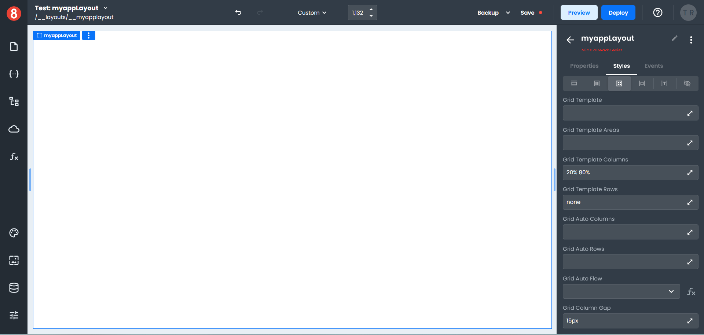

Click in the left column on the canvas to select the menuContainer, and set a **Background** color in the *Styles* pane.

Click the arrow next to the menuContainer name to switch the right-hand pane back to the *Components* pane.

In the *Search*, type "list" to display all the List components.

Drag a *List* component onto the left-hand column of the canvas, which creates a list with two *List Items*; this is your menu. Give your list a name, then click the arrow next to the list name to switch back to the *Components* pane.

Drag a *View* component (orange button) onto the empty area of the canvas; this is where your pages will display. *(If your View component accidentally ends up on the left side of the canvas, just drag it to the right to reposition it.)*

Click the *Page* icon in the left-hand toolbar to switch from Layouts to Pages.

Click on the *Home Page* item to load the page onto the canvas.

Locate the *Heading* component under the **Common** section of the *Components* pane, and drag it onto the canvas. 

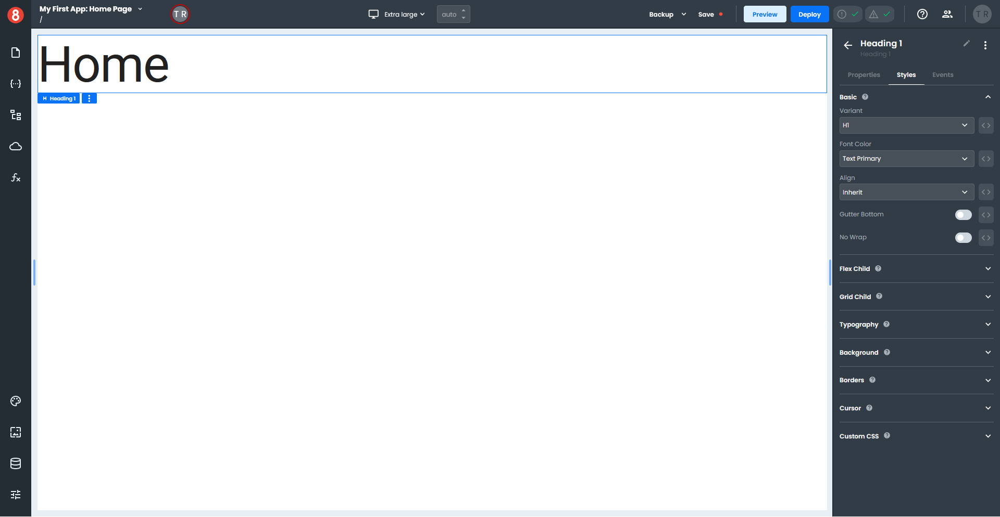

In the *Properties* menu under the **Basic** section of the *Components* pane, enter "Home" in the **Text** field. Click the *Styles* tab and set the **Variant** to H1.

### Adding a Layout to a page

Continuing our example, we must set up the Home Page to use a layout.

Click the *Pages* icon on the left-hand toolbar, then click on the **Gear** icon on the *Home Page* item.

In the *Page Settings* panel under **Page Layout**, select your layout from the Layout drop-down, and click "Save". *(Only layouts in your App that have a View component are displayed in this list.)*

If you return to the Home Page, your layout will display the page.

### Adding data to a Layout
A Layout can access *Data*. More specifically, it can access *Routes* for the page. 

Click the *Pages* icon on the left-hand toolbar and select your Layout to switch to the Layout view. Then click the *State* icon, which opens the *State* panel, and click the *Global* tab.

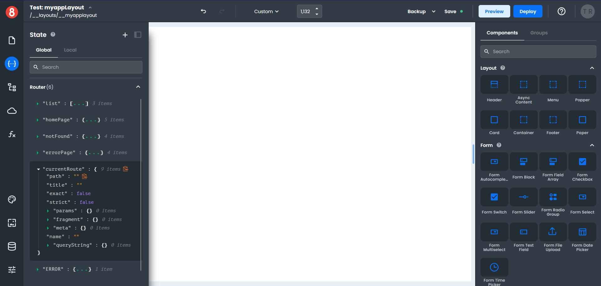

Under the **Router** section, click on the small green arrow next to the "currentRoute" name to see a list of attributes. 

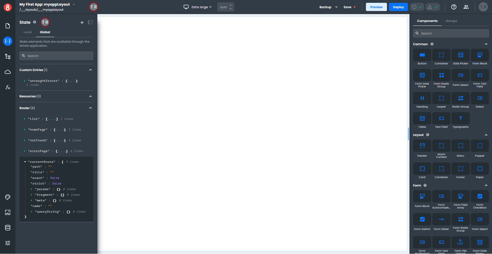

Hover to the right of the "path" attribute, which will display a clipboard icon. Click on the icon to copy the path to the clipboard.

Click on the *State* icon to collapse the *State* panel and return to the Layout view.

Select the first *List Item* in the left column and click on the *Properties* tab in the right-hand pane. In the **Basic** section, paste the copied "path" attribute into the **Text** field. Add two brace brackets to the start and end of the "path" attribute.

The first *List Item* will not display anything in the Layout view, but if you switch to the *Page* view and select your *Home Page*, you will see the "path" displayed in your menu as a forward slash.

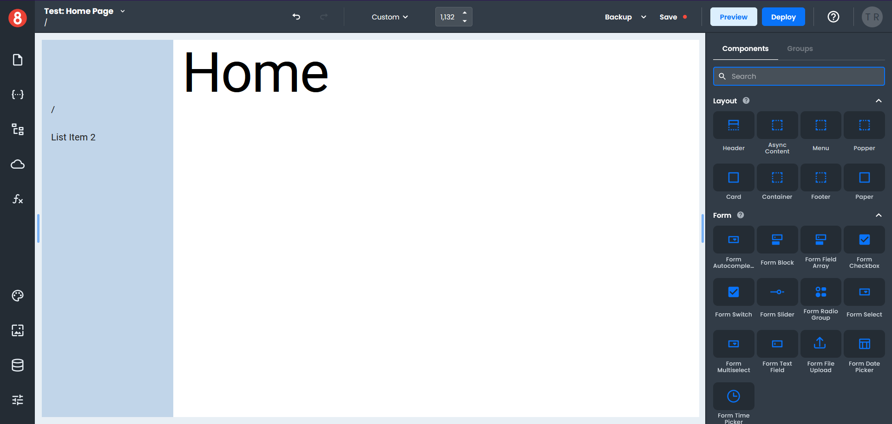

Click on the *Page* icon to return to the list of pages, then click on the *Gear* icon next to the *Contact* page; set the *Layout* to your current layout.

If you still need to created a *Contact* page, do that now.

### Testing a Layout
Let's add some navigation so we can test the layout.

Click on the *Page* icon and select the *Home Page*. In the *Components* pane, search for "button" and drag a *Button* component onto your page. 

Select your page's *Button* component and click the *Styles* tab in the right-hand pane. Set your button's **Size** to a **Width** of 100 and a **Height** of 25.

Click the *Events* tab in the right-hand pane and then click the "+" to add an event and select the **On Click** event.

Click "Choose Action" and select **Navigate** from the drop-down menu. Enter "/contact" as the path in the **Page** field.

To preview the *Home Page* in a web browser, click the *Preview* button in the top toolbar, which opens the page in a new browser tab.

Click the *Button* on the *Home Page*, which takes you to the *Contact* page. Notice the path for the *Contact* page displays in the menu.

### Finishing up
A Layout can access global objects like the router to access information within the page, which helps to create the dynamic aspects of your application.

## How to edit Layouts
We will modify our existing *Layout* to demonstrate how you can edit layouts. 

Click the _Pages_ icon on the left-hand toolbar to display the *Pages* pane. In the **Layout** section, select the layout you want to modify, which loads the layout in the App Builder.

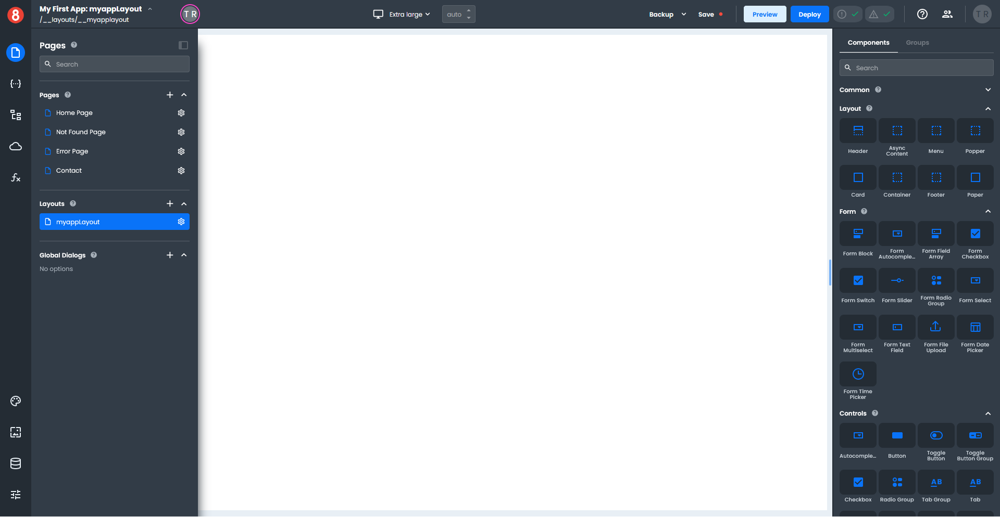

### Adding a Header to a Layout

Select a "Header" component in the **Layout** section of the *Components* pane and drag it onto your menuContainer. It will likely end up at the bottom of your *List*, but we can change the position of it.

Click the _Page Structure_ icon on the left-hand toolbar to display the *Page Structure* pane. The easiest way to move your *Header* is to select your *List* and drag it below the *Header*. 

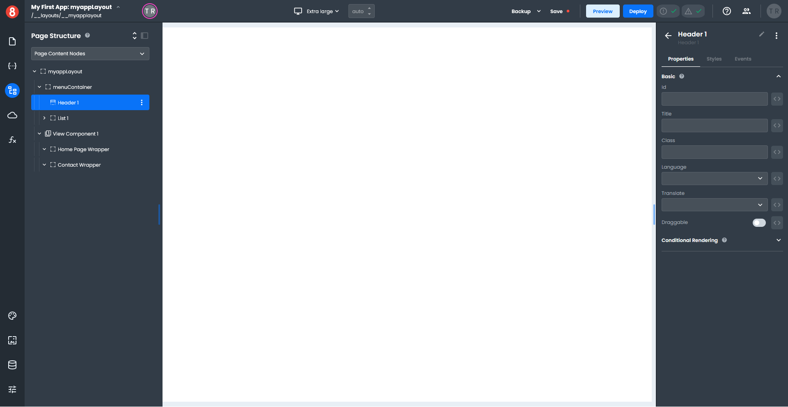

Click the _Page Structure_ icon on the left-hand toolbar to close *Page Structure* pane.

Select your *Header* and click the *Styles* tab in the right-hand pane. Set the **Color** to Transparent, so the background shows through your *Header*. Next, expand the **Size** section in the *Styles* pane and set the **Height** to 100px.

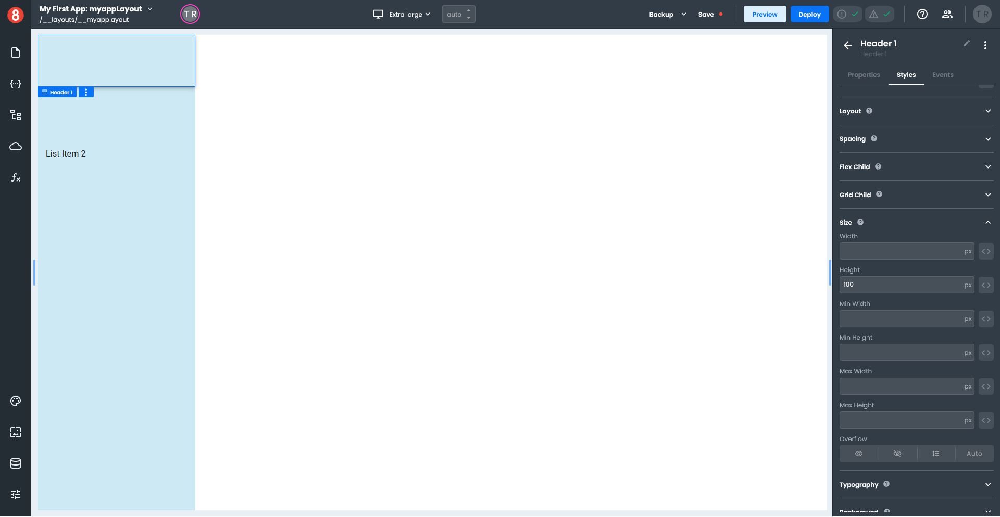

Click the arrow next to the *Header* name in the right-hand pane to return to the *Components* pane.

For this next part will show you two different options:
+ Adding an image - we will add a small image to your header
+ Adding text - we will add a text label to your header

### Adding an image to a Header
From the **Other** section of the *Components* pane, drag an *Image* component onto your header. On the *Properties* tab, click the image icon next to **Source**; this opens an *Assets* dialog window. 

Click the "+" to open the *Upload file* dialog window, then select an image from your computer. Choose an image that is approximately 250px wide by 100px high. 

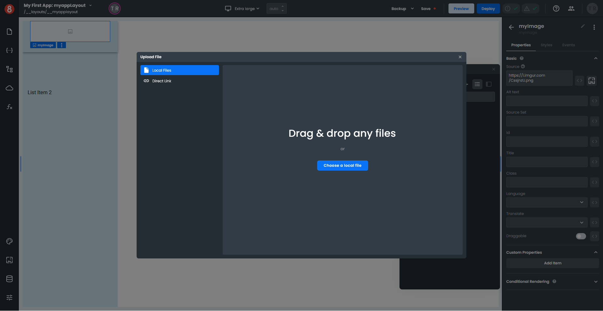

From the *Assets* window select the image you just uploaded; the image will appear in your *Header*. Click the "x" to close the *Assets* window, and add the image name in the **Title** and **Alt Text** fields on the *Properties* pane.

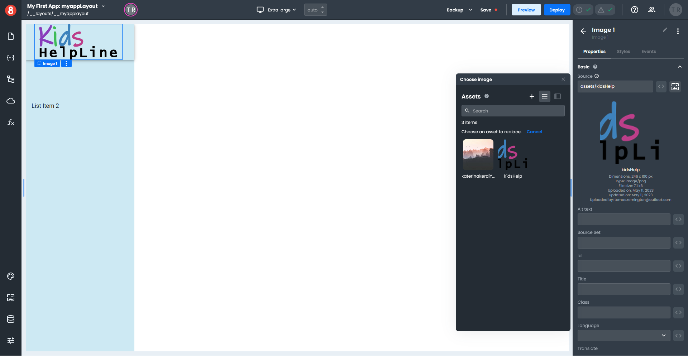

### Previewing your Layout changes
Click the _Pages_ icon on the left-hand toolbar to display the *Pages* pane and select *Home Page* in the **Pages** section. To preview your *Layout* changes, click the "Preview" button on the top toolbar; your *Home Page* loads in a new browser tab.

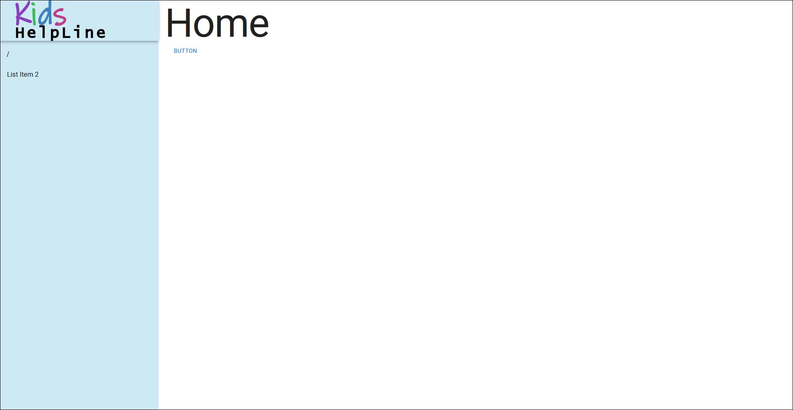

### Adding text to a Header
From the **Other** section of the components pane, drag a *Text* component onto your header. On the *Properties* pane in the **Basic** section where it says "Normal", select "Heading 1" in the drop-down, and where it says "Text", enter "Kids Helpline".

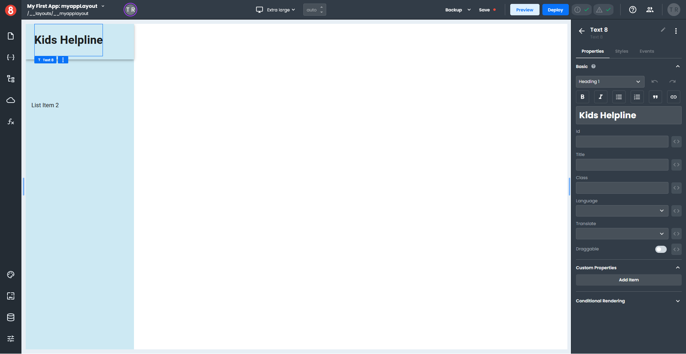

Select the *Styles* tab, expand the **Typography** section, and set the **Color** to Purple.

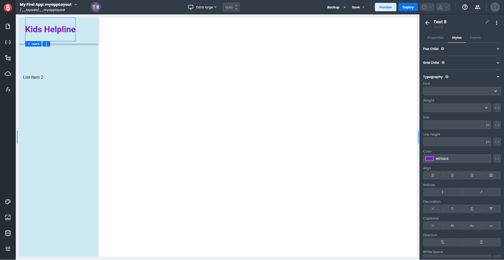

### Previewing your Layout changes
Click the _Pages_ icon on the left-hand toolbar to display the *Pages* pane and select *Home Page* in the **Pages** section. To preview your *Layout* changes, click the "Preview" button on the top toolbar; your *Home Page* loads in a new browser tab.

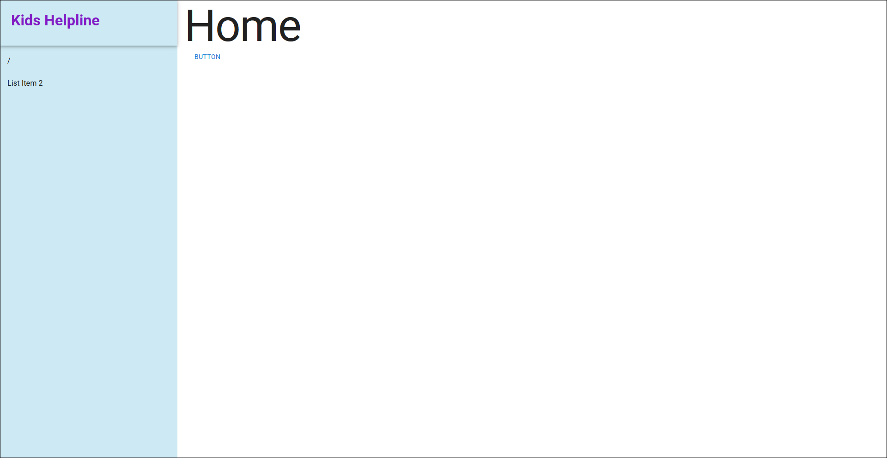

:::info

Remember that when you edit a Layout, any changes made will display immediately on all your pages that use that Layout.

:::