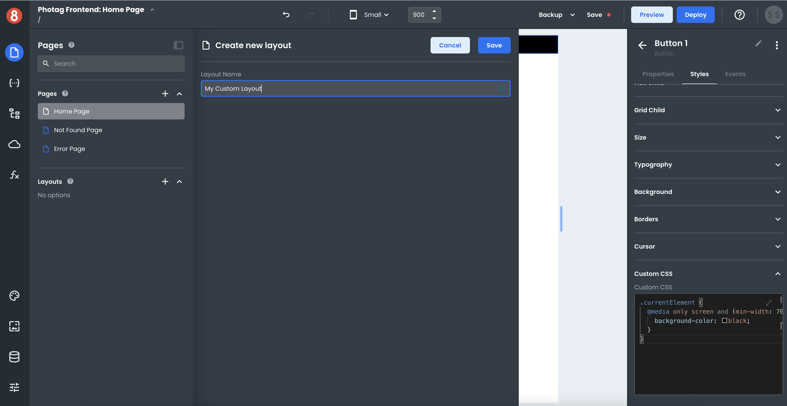

# Introduction

This document describes what Layouts are in App Builder and why they're helpful.

___

When developing an App in App Builder, your Pages will be built using a combination of Layouts and Views. Layouts get used in App Builder to help developers not have to repeat themselves. 

Every Page in App Builder is made up of a Layout and a View. If you have a header, footer, or sidebar that you want to appear on multiple Pages in your app, you can create it once as a Layout and then use that Layout on various Pages.

### Layouts Summary

A **Layout** is a reusable container you can use to arrange components on the Page Canvas. App Builder ships with a few different Layout components, such as the **Authenticated** and **Empty**. You can also create custom Layouts. 

Layouts are not Page-specific and get selected on a page-by-page basis in the Page settings.

### Views Summary

A **View** is all components added to a specific page rendered within the Layout. This means that when editing a Page, you're adding components to a View. Meanwhile, when editing a Layout, you're adding components to the Layout that will be available on all Pages using that Layout.

All this said Layouts and Views are always displayed and updated through the Page Canvas.

## Next Steps

In the following sections, we'll cover how you can add and configure Layouts in App Builder.