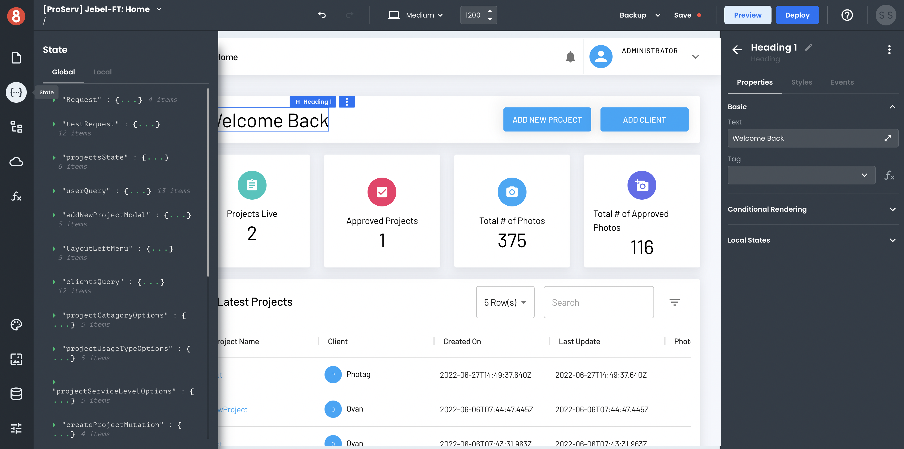
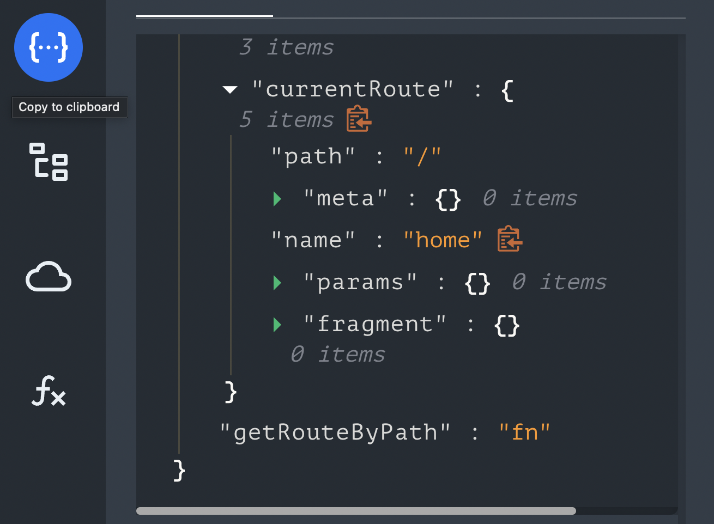
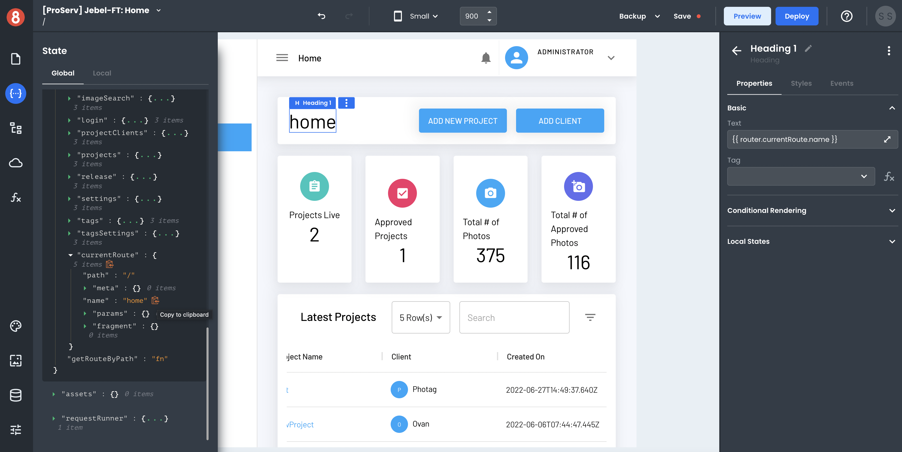

# Accessing frontend data in App Builder

To access data in frontend applications, App Builder uses a State management system to store frontend data and reflect the attributes and data of App Builder elements, like Components and Requests. This object is accessible to any element within App Builder. Any data that needs to be accessed by multiple elements can be stored in this global object for easy retrieval.

Additionally, states can be segregated between items being local or global. While Global states are accessible by any element, Local states are only accessible by the elements within the Page they got created within. This allows for state data to get easily organized.

## Opening the State modal

The first step in managing state data is to open the State modal. This can be done by clicking the "{...}" icon in the left menu. The opened modal will show tabs for both Global and Local state data. 

## Accessing State data in a Component

To access state data in a component, you'll first need to drag and drop a component onto the Page. Go ahead and try adding the Text Component.

Once done, open your State pane and expand any entries with key/value pairs. When hovering over any key or value, you'll see a small clipboard icon to the right of the entry. Clicking on this icon will copy the state accessor for you to use as the input to your Component property.

In App Builder, all inputs are handlebars enabled. This means you can dynamically read any state value as an input to your Component property. 

For example, click the clipboard icon next to any text value in your app's state and then paste it into the Text Component's "Text" input like so `{{ stateObjectName.keyName }}`. Once done, you should see the rendered value on your page canvas within the component instance.
