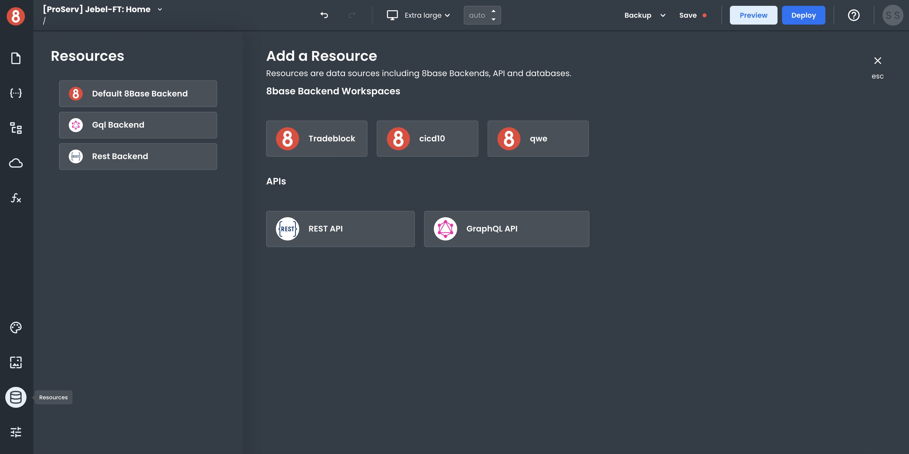
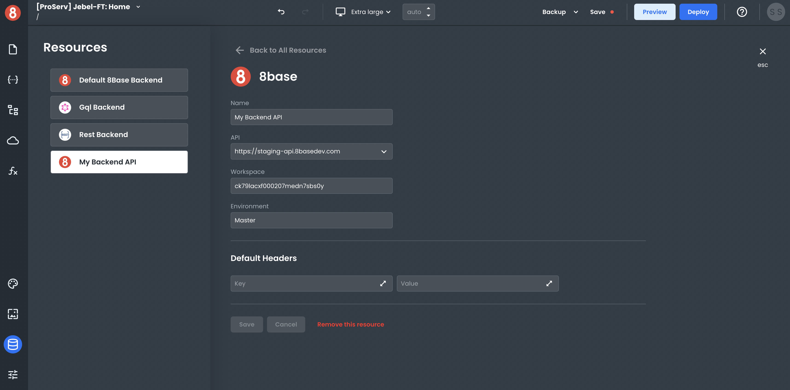
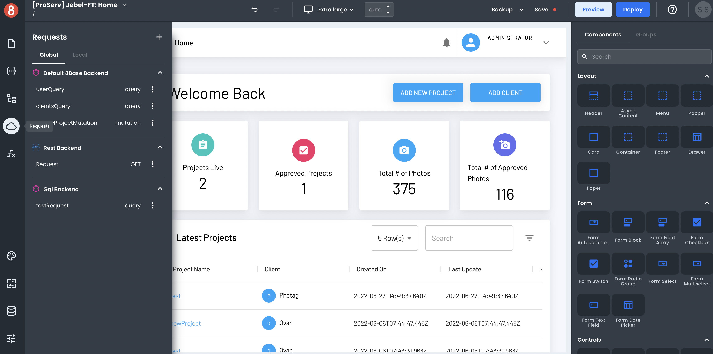

# Connecting to a Data Source (8base BE Workspace)
 
A data source is an API client you can send requests from your app to get data to your pages and interact with APIs. In this document, we'll walk through the steps of getting one set up.

## Setting up an 8base Backend Data Source

To set up a data source, click on the Resources icon in the left-side menu. It will open a modal that lists all of the available data sources. Currently, App Builder supports connecting to an API via REST or GraphQL, as well as an 8base Backend. 

8base makes it easy to connect to an 8base Backend. In the "Add a Resource" area, click on any of your 8base Backends listed to set it up as a Resource. This will add it to your Resources list on the left modal area.

App Builder also supports both REST APIs and GraphQL APIs.

## Configuring an 8base Backend Data Source

After your 8base Backend is selected, click on it in the list of the available resources. You'll then be able to choose the endpoint and environment (if connecting to a backend that has CI/CD) and set any default headers you want to send with requests.

With 8base, it's easy to connect to the data source of your choice and start building the app of your dreams. Get started today! 

## Making an API Request to the Data Source

Once your Resource gets configured, it will become available in your app! You can then make API requests to it using the Request Modal.

To create an API request, click on the "+" button in the top-right corner of the Request modal.

In the Request create form, you can select to which Resource you want to request and the different settings for that Request. The input variables, headers, and operation type can all be set. These options will vary based on the type of data source you're sending the Request to (e.g, GraphQL, REST, 8base Backend).

After you've made your request, you'll see the response. The data also gets stored in the State pane, making it accessible by components and other parts of your app.