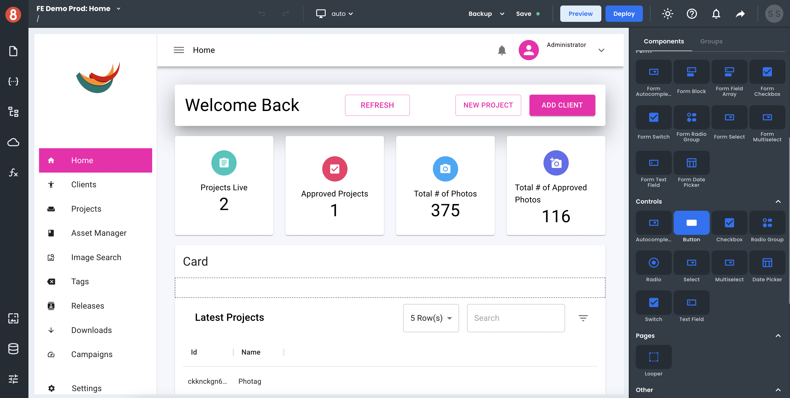
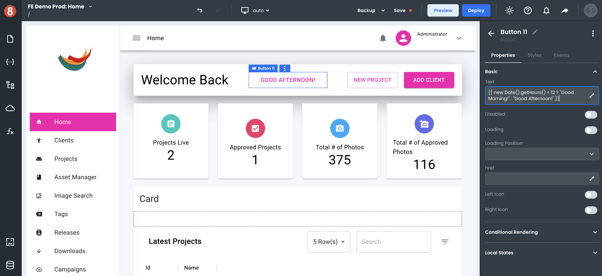
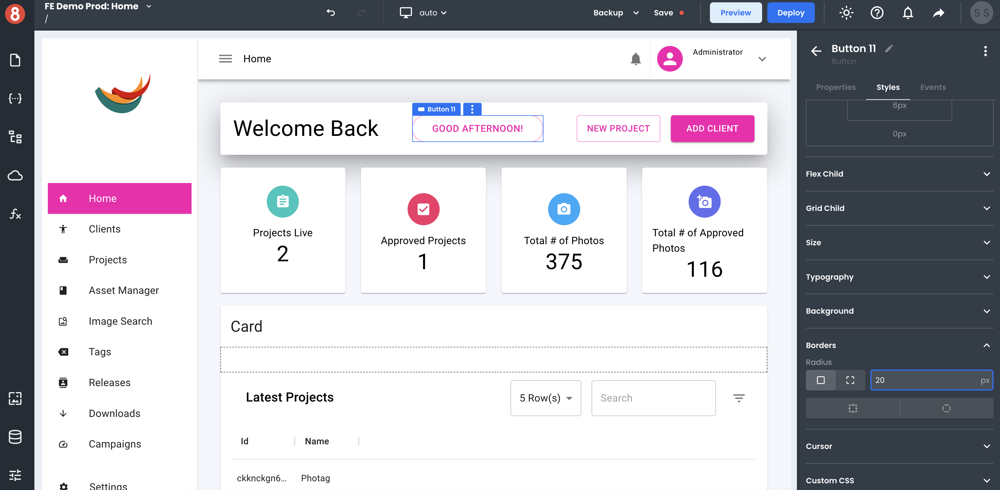

# Dragging and dropping Components

App Builder provides a simple way to create custom user interfaces using pre-built components. You can quickly create UIs using pre-built components and customize their properties, styles, and event listeners. This makes it easy to get started with building your web application's pages.

To use this feature, simply drag-and-drop a component from the Component Library located in the right-screen area of the editor onto the canvas. You can then customize its properties, styles, and event listeners in the right-screen Component Settings area of the editor. This makes it quick and easy to create custom UIs without having to write any code. 

## Component Properties  

You can set Component properties to affect the behavior of a component and its data. For example, you can set the "isLoading" property of a Button component to true to make the button disabled and display a loading spinner instead of the button's label. You can also set properties in the Component Settings area of the Editor. 

Most inputs are Handlebars enabled, meaning that you can write expressions and use functions inside the inputs to determine values. For example, you can a greeting message on a Text component to be `{{ new Date().getHours() < 12 ? "Good Morning!" : "Good Afternoon!" }}` to dynamically render a time-sensitive (get it) message to your user.

## Component Styles 

You can also use the Styles pane to update the appearance of a Component. For example, you can change the background color, font size, and padding of a Button component. Styles changes will immediately be reflected on the rendered component so that you can see exactly what your component will look like before you save any changes. 

App Builder also provides a number of different ways to customize the look and feel of your Components. You can use the built-in themes, or you can create your own custom themes. You can also use the CSS Editor to directly style your component's styling pane. This gives you full control over how your component looks and feels.

## Component Events

You can add event listeners to components in the Component Settings area of the Editor. Simply click on the "+" icon button in the "Events" tab of the Component Settings and select the event you want to trigger an Action on. You can then choose what action to take when that event is triggered. For example, you can navigate to a different page when a button is clicked, or you can run custom Javascript code. 

Adding event listeners is a quick and easy way to add interactivity to your components without having to write any – or not too much – code. This makes it easy to create UIs that are interactive and responsive to user input. 

## Using the Page Structure Pane

The Page Structure pane shows the hierarchy of components in a list. You can use this pane to re-organize the hierarchy of a page. This is useful if you want to change the order in which components are rendered on the page or find nested components and containers that may be visually hard to find in the application visually. 

To use this feature, simply drag and drop a component from the Page Structure pane onto the canvas. Conversely, you can also drag and drop components from the canvas into the Page Structure.  This will change the parent-child relationship of the components and update the page accordingly. 