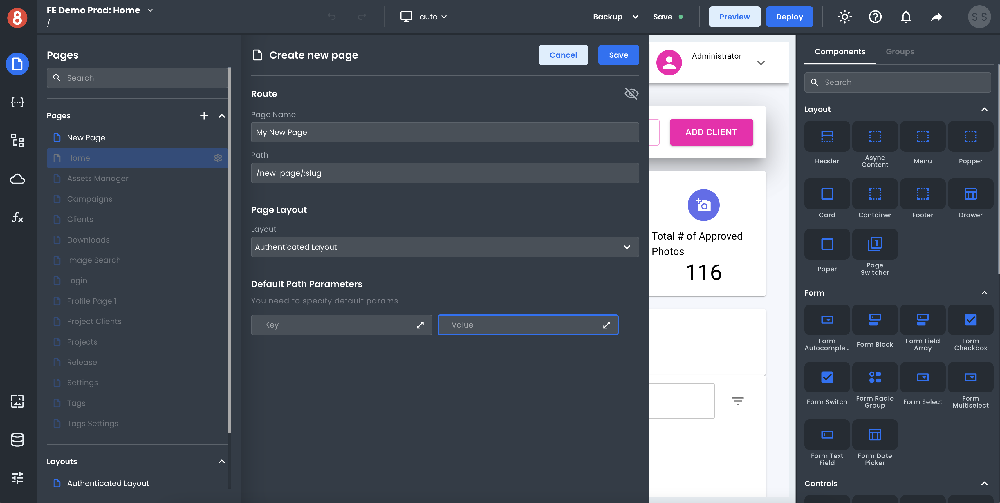
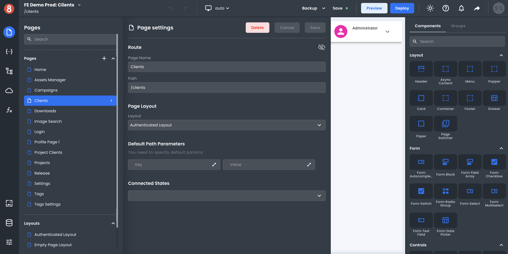

# Managing App Pages

When building an app in the 8base App Builder, you will typically have multiple pages that make up the overall app. Each page can have its own name, path with URL path parameters, layout, and other configurations. To manage pages in your app, go to the "Pages" section in the left sidebar of the App Builder Editor.

## Creating a New Page

To create a new page, click the "+" button in the "Pages" modal. This will open up a nested modal where you can enter the name and path of the new page. The name is for internal use and will be used to reference the page in the App Builder Editor. The path is the URL path that will be used to access the page when viewing the app in a web browser.

After you have entered a name and path for the new page, click the "Save" button at the bottom of the modal. This will add the new page to your app and open it up in the App Builder Editor.

## Editing a Page's Settings

To edit an existing page, click on the gear icon to the right of the page name in the "Pages" section. This will open up the nested page settings modal in the App Builder editor. From here, you can change the name, path, layout and other settings of the page. When you are finished, click the "Save" button at the top of the modal.

## Changing the Page Layout

To change the layout of a page, click on the "Layout" tab in the "Page Layout" panel. This will open up a select menu where you can select from all your different layouts. When you have selected a layout, click the "Save" button at the top of the modal.

## Deleting a Page

To delete a page, click the "Delete" button in the top-right corner of the "Page Settings" panel. This will open up a modal asking you to confirm that you want to delete the page. If you are sure that you want to delete the page, click the "Delete" button at the bottom of the modal. Otherwise, click the "Cancel" button.

## URL Path Parameters

Each page in your app can have its own set of URL path parameters. These parameters can be used to dynamically generate the URL path for a page. For example, if you have a page with the path "product/:id", you can use the id parameter to specify the product that will be displayed on the page.

To manage URL path parameters for a page, click on the "Path" input in the "Page Settings" panel. In here, you can simply type in the path value you that you want and prefix any path section with a `:` to denote it being a dynamic param.

When adding dynamic path parameter, you can also enter its name and default value in the "Default Path Parameters" section. The default value is the value that will be used if no value is provided for the parameter.

After you have added a parameter, you can edit its name and default value by changing the input key or value.

To delete a parameter, click on the trash can icon button next to the parameter declaration.

When you are finished managing parameters, click the "Save" button at the bottom of the modal.
