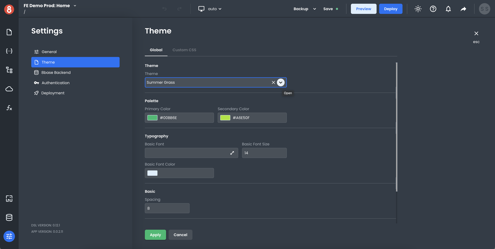

# Selecting a design theme

8base App Builder provides an easy way for you to select a custom design theme for your web application in the `Settings > Theme` area of the editor. You can choose from a number of predefined theme options, or you can create your own theme by modifying the Custom CSS style sheet.

When you select a theme, it will be applied to your entire web application. This includes the colors, fonts, and overall styling of your application. You can customize any of these elements to match your brand or company's style guide. For example, setting a custom primary or secondary color.

You can also create your own custom theme by modifying the Custom CSS stylesheet. This is a great way to get exactly the look and feel that you want for your web application.

Once you've selected a Theme and updated any inputs, make sure to hit save!
