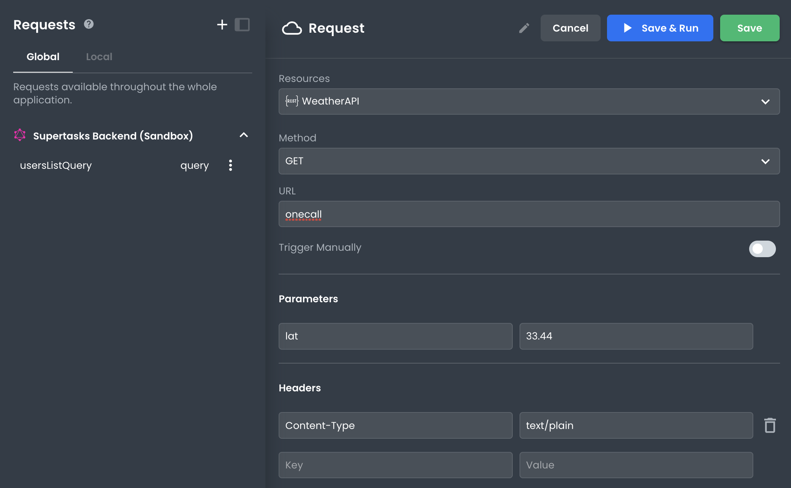
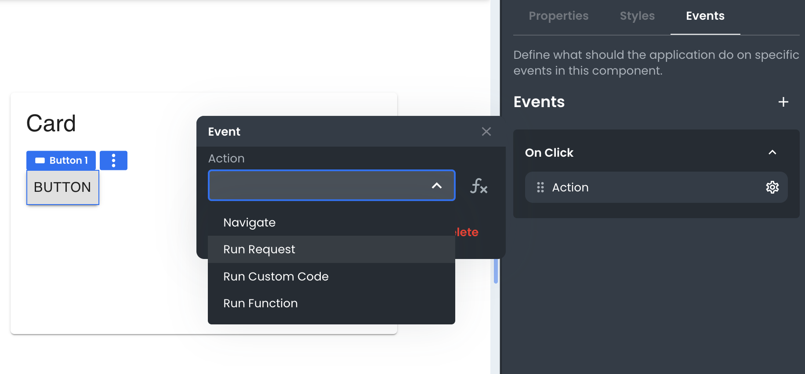
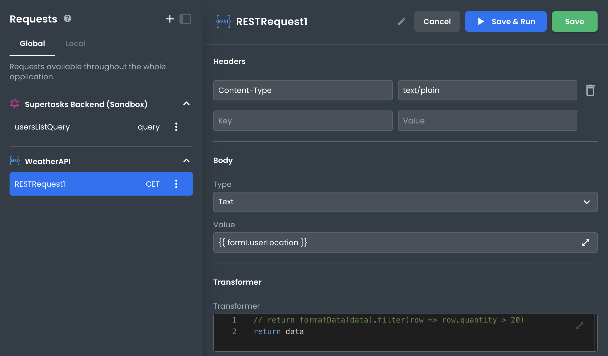

# How to execute a REST API Call

This article describes how developers can execute a REST API Call.

___

There are several strategies for running REST API Calls in App Builder; both in development and the built app. They include: 

• Using the "Run" button in the Request Pane

• Setting a Request to run on an Event (i.e. Button Click)

• Calling the Request in code

## Using the "Run" button in the Request Pane

When viewing a REST API Request request in App Builder, you'll notice a "Run" or "Save & Run" button at the top of the Request pane.



Pressing this button will run the request and populate the response pane with the result so you can preview it. Know too that running the request will save the response data in the state. This means you can bind this data to UI elements in the app during development.

## Setting a Request to run on an Event

App Builder allows you to set a request to run automatically on specific events in your app. For example, you could set a Request to run when a user clicks a Button. We refer to these as actions.



To do this, select a component on the canvas on which the event listener will be set.  Then, in the **Events** pane, click the **+** button to add an appropriate event listener, then select **Run Request** from the Actions menu. Finally, select the Request you want to run. 

Now when the user interacts with the element on the screen, your GraphQL Query or Mutation will automatically execute and populate the state in App Builder so you can reference what data is returned. 

## Executing a Request with code

Requests can be executed from any location where code can be used.
```javascript
//Assuming the request is called myQuery
Promise p = myQuery.run();
```
Request will return a Promise, so if the code block wants to wait for the results to be recieved the code should look like this
```javascript
let results = await myQuery.run();
```

## Executing a REST Request with Variables

When a REST requires variables to be sent with it (i.e., query params, form data), those data can be set in the Request's settings.  



Variables can be set dynamically by adding expressions to the value input. For example, a request may pull its' variables values from different inputs in a form by referencing their state accessors or another object stored in the state.
