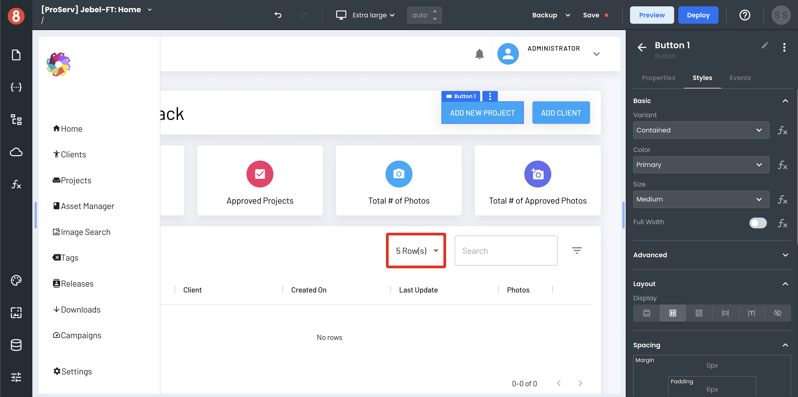
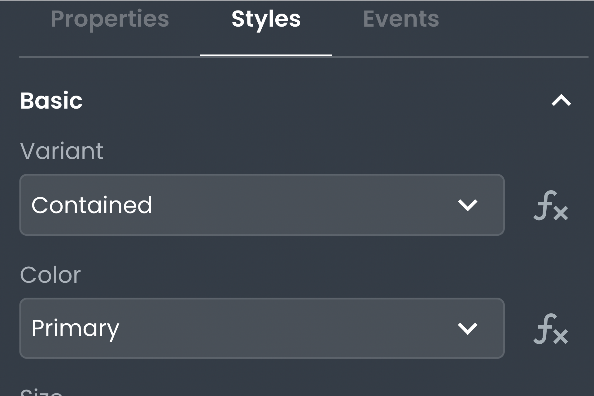

# Component Styling Settings

This document describes how you can use the App Builder Styling Pane to style your components once they're added to the Page Canvas.

## Styling Component Instances

Component instances are individual instances of that component placed onto the page. They will inherit the default styling from the component library but can be individually styled as well. You're able to style them using the styling pane or add custom CSS to the component.

## Adding Custom Styles with the Styling Pane

The App Builder Styling pane enables you to visually style component instances using a set of tools. It provides options to change colors, font properties, spacing, and more. Pretty much, any CSS property you'd be able to add using syntax can be added using the Styling Pane.

The changes you make with the styling pane are only applied to the component instance that's selected on the page. The changes you make will not affect other instances of the same component or affect the default styles for that component.

You can access the styling pane in the "Style" tab of the right drawer when a component is selected.

### Setting Style Values using Code

You can determine the value of style inputs using JavaScript code. On inputs where this applies, you'll see an "Fx" button next to the input. To leverage it, click the button and then expand the input to use the code editor.

This is useful when you want to dynamically determine a style property, such as setting the background color based on the value of a field.

## Adding Custom CSS with the Styling Pane

In addition to setting style values with the Styling Pane, you can also add custom CSS. This is useful when you want to add CSS properties that aren't available using the Styling Pane or if you want more control over the order in which properties are applied.

To add custom CSS, open the "Custom CSS" tab in the Styling Pane. In the "Custom CSS" editor, you can add CSS properties just as you would in a code editor. The changes will be applied to only the component that is selected on the page when you make them.
