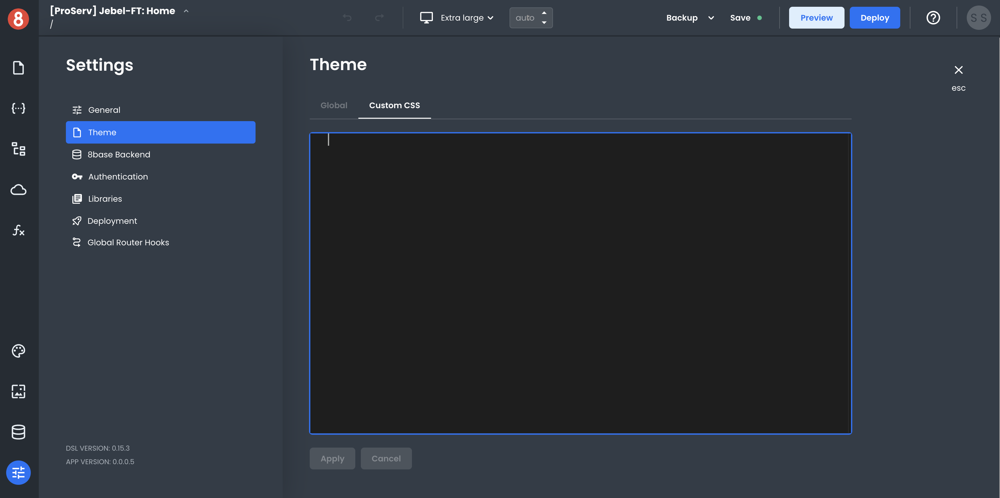

# Exporting / Importing App Themes

This document describes exporting/importing App Themes.

App Builder currently doesn't support the importing or exporting of a Theme. You can, however, manually add or copy your theme's custom `css`. This is available in the `Settings > Theme > Custom CSS` tab of the editor.

We recommend saving any custom CSS  in a separate file and using a tool like `git` for versioning control. This is also considered a best practice currently when writing custom CSS in media queries.

:::info
Adding Custom CSS to your App Builder project will result in those changes being applied globally. 
:::