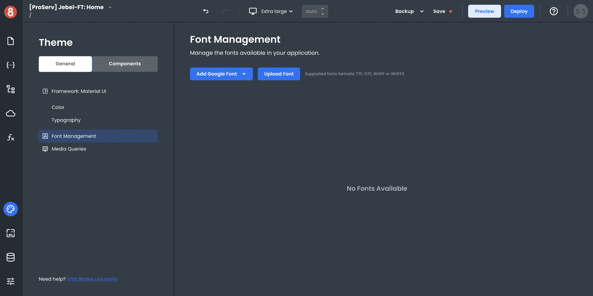
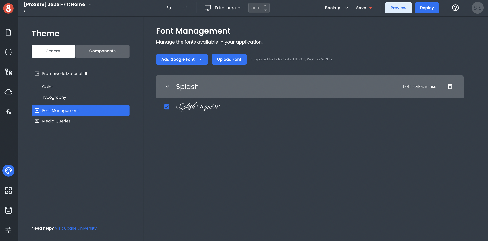
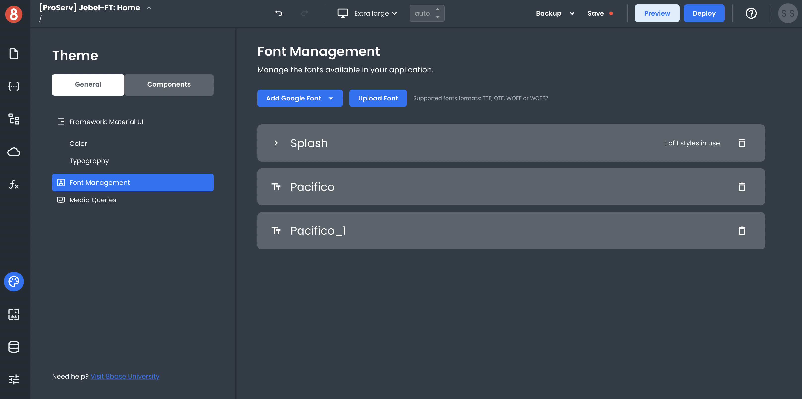
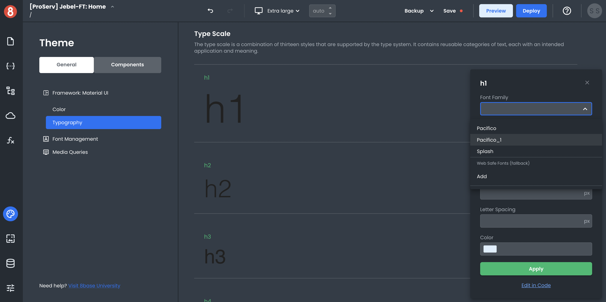

# Adding custom Fonts and Icons to your App

To add custom Fonts and Icons to your App Builder project, you must include them in your project's theme resources. You can do this by navigating to the "Font Management" section of your project's Themes area!

## Ways to add Custom Fonts

There are two ways to add Custom Fonts to your project:

- **Upload a new font**: If you have a .ttf (TrueType Font) or .otf (OpenType Font) file, you can upload it directly into your project.

- **Import a Google Font**: If you want to use a Google Font in your project, search for it by name and select the import button.

### Selecting a Google Font

The "Add Google Font" dropdown lets you search for any Google Font by name or select one from the list. Type in the name of the Font you want to use, and click on the list item to import it.

Once the Font is imported, it will be available in the App Builder interface for you to select and use.

## Uploading Custom Fonts

You can upload a TTF, OTF, WOFF, or WOFF2 font file directly to App Builder using the "Upload Font" button in the App Builder interface.

Once the Font is uploaded, it will be available in the App Builder interface for you to select and use.

## Using an Uploaded Font

You can specify which fonts get used at the Global, Component Default, or Component Instance level of your App. Any uploaded/imported font will become available in the dropdown list on a font input.

Know that the font name can also be input manually into a CSS rule, such as `font-family: Pacifico;`

## Adding Custom Icons

Custom Icons are currently not supported. Please use the Icon Component that's available in the Component Library.
