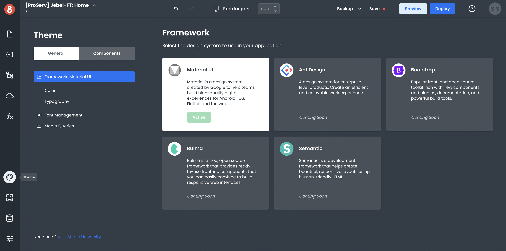
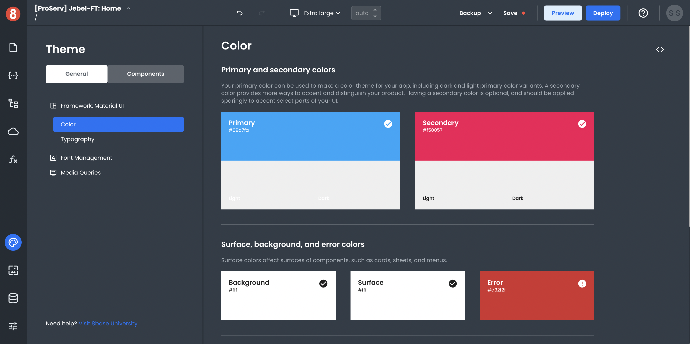

# Using a CSS Design Framework
App Builder is designed to let you use a CSS Design Framework to change the look and feel of your app and all its components, making it look exactly the way you want. This means you can leverage the same popular CSS Frameworks that you're used to and are widely supported/available!

## Accessing the CSS Framework Menu

You'll need to open the CSS Framework Menu to change your app's CSS Framework. You can do this by clicking on the "Theme" button in the App Builder left toolbar.

This will open the Themes Pane on the right side of the App Builder. Available Frameworks will be shown by default.

## Selecting a CSS Framework
Once in the Framework area, you can quickly change Frameworks by clicking the "Activate" button under each Framework.

## Additional Customization Options
Different Frameworks have different customization options. When you select a specific Framework, you'll be shown that Framework's unique options. These will appear in the nested left menu under the active frameworks name.

## Current State
The current default styling for all Components in App Builder is based on Material UI (https://material-ui.com/). This is the only supported CSS Design Framework at the moment. However, more will be coming soon!
