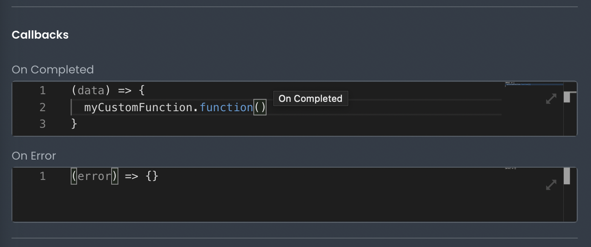

# Calling a Function from a Callback

This article describes how developers can call a function from a Callback.
___

There are multiple ways to execute a Function in App Builder. One way is on a Callback. App Builder lets developers set code to run on a callbacks that are trigged on Request responses ("On Success" or "On Error").



Inside the callback function, you can execute a function object by referencing its name and calling its `function()` method.

```js
(data) => {
  const result = myCustomFunction.function()
  // more code
}
```

Once saved, the Function will be executed whenever that callback is executed.
