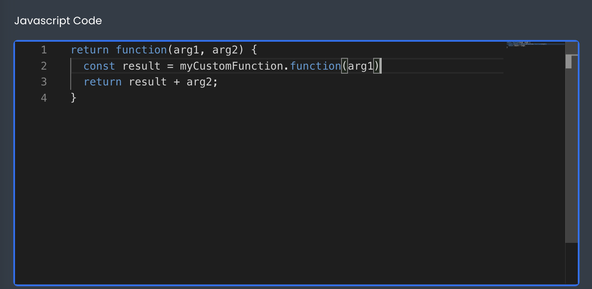

# Calling a Function from a Function or Script

This article describes how developers can call a function from a function or script.
___

There are multiple ways to execute a Function in App Builder. One way is in other functions and scripts. 



Inside another function or a script, you can execute a function object by referencing its name and calling its `function(...args)` method and passing any arguments.

```js
return function(arg1, arg2) {
  // Code calls another function and gets result
  const result = myCustomFunction.function(arg1)

  // Returns sum of both values
  return result + arg2;
}
```

Once saved, the Function will be executed whenever the host function or script is executed.
