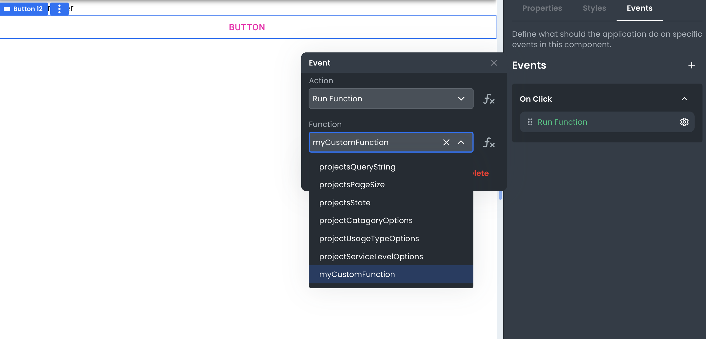

# Calling a Function from an Event

This article describes how developers can call a function from an event.

___

There are multiple ways to execute a Function in App Builder. One way is to use an Event. App Builder lets developers set event listeners on Components in the **Events** section of the Component's **Settings** (see screenshot above). 

Once in the Events configuration pane of a Component, a developer can add a specific Event type by selecting it from the list of available Events. This will create an "Action" that can then get configured to "Run Function" selected from the list of available functions.

Once configured, the Function will be executed whenever that Event is detected.
