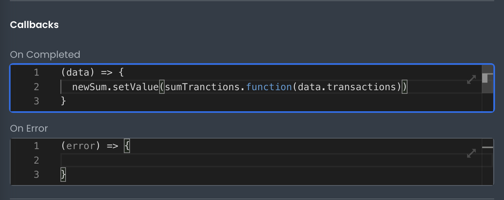

# Calling Frontend Functions

This article describes how developers can call frontend functions in App Builder\_\_\_

---

In App Builder, developers can add custom frontend logic by calling frontend functions. This is useful when you want to perform an action on the client side, yet encapsulate your code in a reusable function.



To call a frontend function, use the `function` method on the Function's state object:

```javascript
myCustomFunction.function(...args);
```

The `function` method will return a promise if it is asynchronous or the function result if it is synchronous. Know that functions can be called in any area that allows for Javascript to be written, or any input where handlebars expressions are enabled (example: `{{ myFunction.function(...args) }}`).
