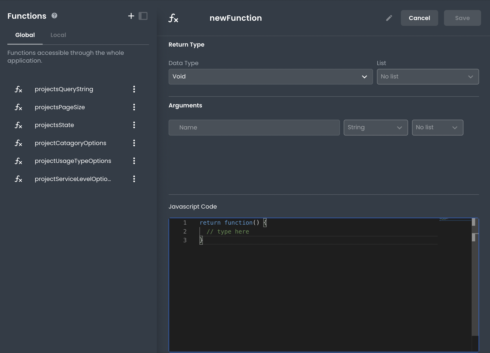

# Creating Custom Frontend Functions

This article describes how developers can create custom frontend functions in App Builder.

___

Creating new Function in App Builder can be done by using the "Functions" tab in the left sidebar and clicking the "+" button. This will open the "Create New Function" modal.

In the "Name" field, developers can give their Function a name. You can also optionally specify a return type and arguments for the Function.

The "Javascript Code" field is where developers will write their custom logic for the Function. This can be done in JavaScript.

Once satisfied with your Function, click the "Save" button to save it. Your new Function will now be available for use in App Builder (in the Global or Local namespace).

## Arguments

Arguments can be specified when creating a new Function. These arguments will be available to use in the body of the function. Make sure to set the argument names in both the function code and the Arguments list, as the Arguments list will enhance your function with added validations.

Arguments can be given a name and a type (string, number, bigint, boolean, symbol, or object) and declared as a single value or list of the specified type. 

