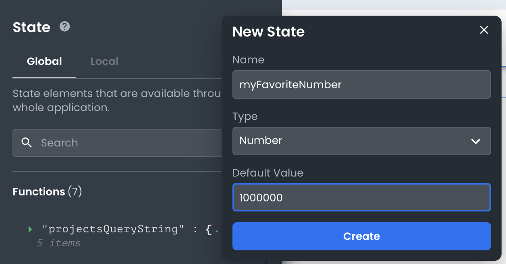

# Adding custom state data entries

This article describes how developers can add custom state entries in their front-end applications.

---

## What are custom state data entries?

Custom state data entries allow developers to add extra information to their applications' front-end state. This extra information can be used to track application data or temporarily persist data on the client side (in `localStorage`).

## How do I add a custom state data entry?

To add a custom state data entry, developers should open the State Management pane in their project and click the "+" button. This will open the "Add Custom State" dialog, where developers can choose a key, data type, and default value for their new state entry.

**Available types:**

- Boolean
- Number
- Object
- String
- Array

Whether you create the custom state entry within the global or local namespace will affect its visibility to other elements' scopes. See [understanding local vs. global state](./data-in-the-frontend-understanding-local-vs-global-state-objects.md) documentation for further detail.

## What are some use cases for custom state data entries?

Custom state data entries can be used for a variety of purposes, including:

- Tracking application data
  : e.g. a "currentUser" entry that stores information about the logged-in user

- Temporarily storing data on the client side
  : e.g. a "cart" entry that stores information about items in a user's shopping cart

- Debugging purposes
  : e.g. an "isDebug" flag that enables/disables certain features in the application for debugging purposes

They are a very flexible feature of App Builder that can enable anything from custom authentication flows to new theming configurations.
