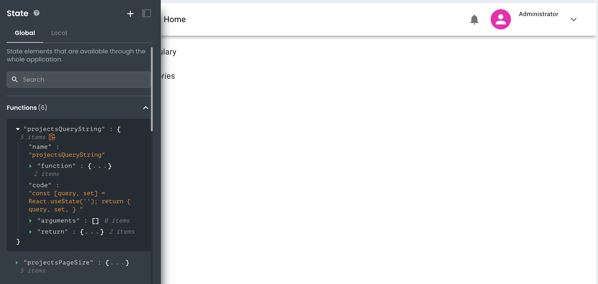

# Data Scopes for App Builder Functions

This article describes how developers can expect data scopes to be applied when working with Functions.
___

When working with App Builder Functions, developers can expect data scopes to be applied in the following way:

## Local Scope

If a Function is created within a Local namespace, that Function's state will be read-only accessible by only elements (other Functions, Requests, and Components) contained within the same Local namespace (Page). 

Additionally, the function will only have visibility to element states that expose their state to the same local namespace. Custom state entries are always read/write accessible, whereas most states created and managed by App Builder are always read-only.

## Global Scope

If a Function is created within the Global namespace, that Function's state will be read-only accessible by all App Builder elements, regardless of the namespace. 

However, the Function will only have visibility to element states that are also Global namespaces. This can be easily conceptualized as a parent (Global) and child (Local) relationship, where the child has visibility into the parent while the parent doesn't have visibility of their children.

## Summary

To summarize, when working with Functions within App Builder, developers can expect data scopes to be applied in the following way:

- If a Function is created within a Local namespace, that Function's state will be read-only accessible by only elements (other Functions, Requests, and Components) contained within the same Local namespace (Page). 

- If a Function is created within the Global namespace, that Function's state will be read-only accessible by all App Builder elements, regardless of the namespace. 