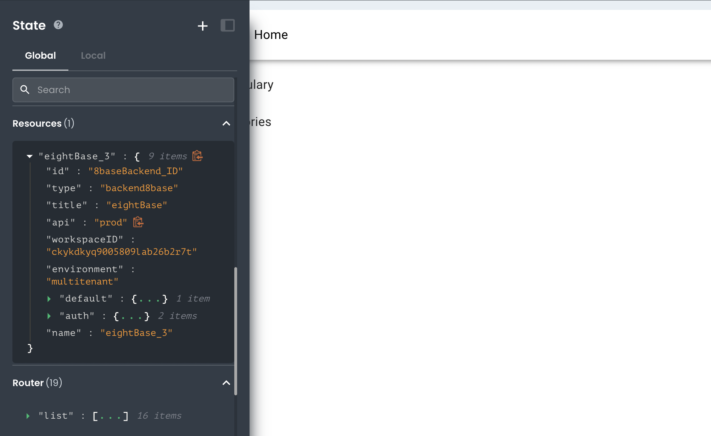

# Data Scopes for App Builder Resources

This article describes how developers can expect data scopes to be applied when working with Resources.

---

When working with App Builder Resources, developers can expect data scopes to be applied in the following way:

## Local Scopes

Resources have no visibility into local scopes, as well as no local scope in which they can be created.

## Global Scopes

All Resources exist in the Global state and have access to any global state entries in the App, such as other Resources, Router, and any custom state entries added to the global state. This allows them to use global state entries as inputs for Resource settings (i.e. a HTTP header value).
