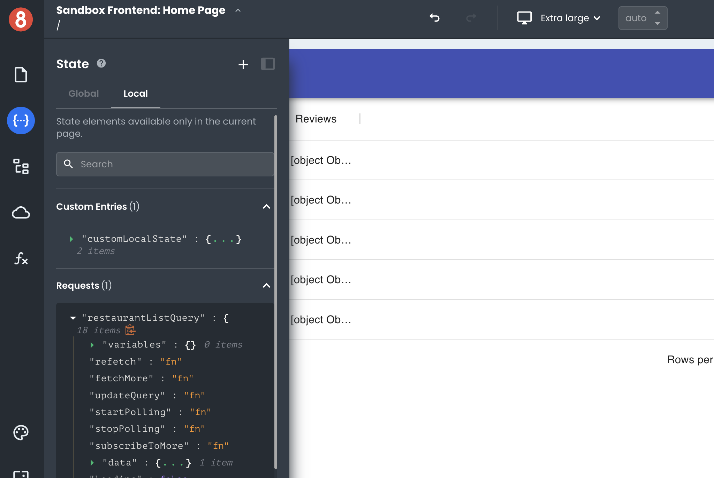

# Data Scopes for App Builder Views (Pages)

This article describes how developers can expect data scopes to be applied when working with Views (Pages).

---

When working with App Builder Views - Pages constructed using a Layout and a View component that are assigned to a unique page URL - developers can expect data scopes to be applied in the following way:

## Local Scopes

A local namespace is created for every View created in App Builder. This allows developers to add custom state entries with reading/write permissions from any element within the View; Functions, Requests, and Components.

## Global Scopes

Any View has access to any global state entries in the App, such as Resources, Router, and any custom state entries added to the global state.
