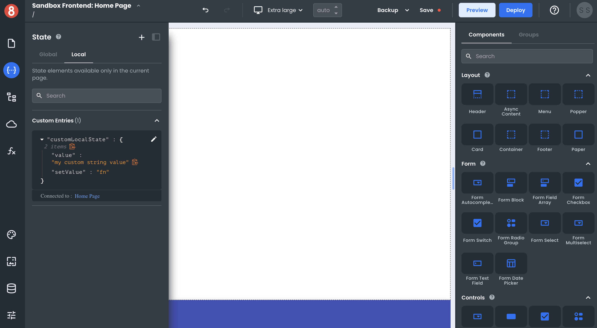
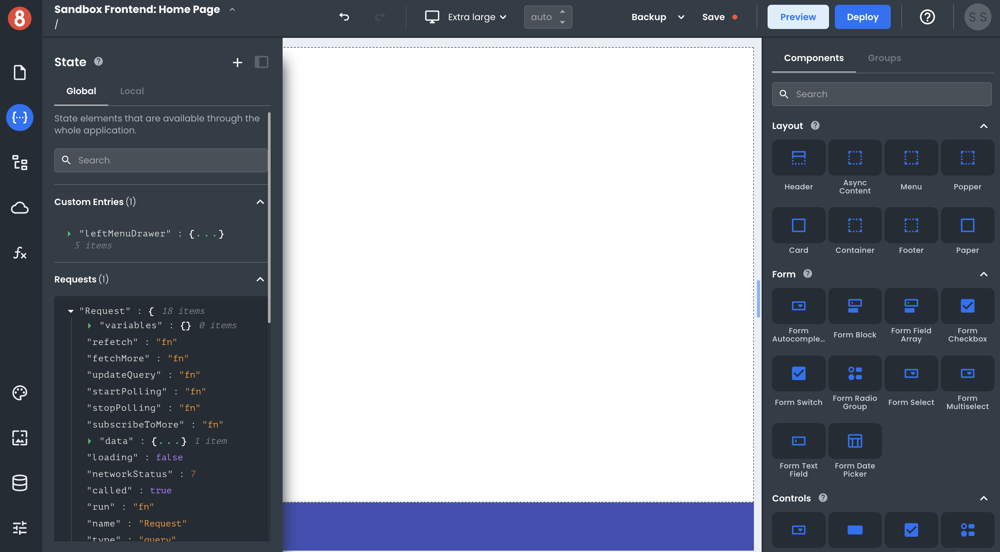
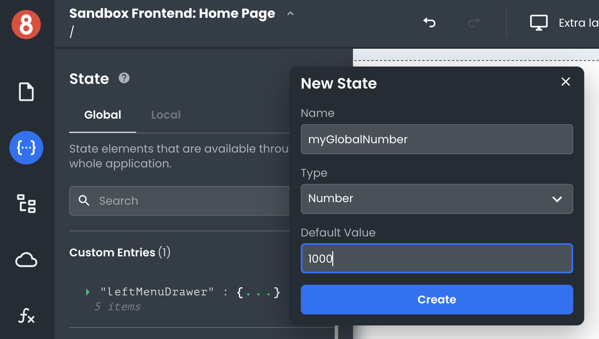

# Understanding Local vs. Global State Objects

This article describes the difference between Global and Local state objects when working with App Builder's state management system.

___

When working with App Builder, it's essential to understand the difference between Local and Global state objects. You may want to use one or the other, depending on your needs. Here's a quick overview of each:

**Local state objects** are specific to the Page on which the _Component_, element, or _Custom State Entry_ was created. They're only accessible (have a contained scope) within that Page's different elements. This makes them ideal for minimizing clutter in the Global namespace or storing information specific to a single page or component

**Global state objects** are accessible from anywhere within your app. This is because they're stored at the Global level. Global state objects help store information that needs to be accessed across Pages or other parts of the application, like _Themes_ or _Resources_.

## When should you use Local state objects?

Local state objects are ideal when you need to:

- Store information specific to a single Page or component. For example, if you had a _List_ element on a Page and wanted to store a custom property about a user interaction with the list, a Local state object would be a good choice.

- Keep the Global namespace clean and organized. You can avoid polluting the Global namespace using local state objects with unnecessary variables or entries.

## When should you use Global state objects?

Global state objects are useful when you need to:

- Access the same information from multiple Pages or other parts of your app. For example, a Global state object would be a good choice if you wanted to store user preferences that could be used throughout the app.

- Minimize the risk of name collisions. Since Local state objects are specific to a Page, there's always the risk of having two different Pages with Local state objects with the same name. By using Global state objects, you can avoid this issue.

## How are Global vs. the Local States managed?

When creating _Requests_, _Functions_, and _Custom State Entries_, you're able to first select which namespace you want to enter the element into by selecting the relevant tab ("Global" or "Local") in the pane. 

Once either "Global" or "Local" is selected in any element's management pane, go ahead and click the "+" icon. This will show you the elements create form, and once created, add it to the relevant namespace.

## Are Components Global or Local?

App Builder automatically manages many different elements' scope based on where they are applied/added to your app. For example, your Theme values are always accessible from the Global State, while certain Component Instances - depending on whether they're added to a Page or Layout, will vary.

## Next 

In the following sections, we will look at the scoping of different types of elements available in App Builder.
