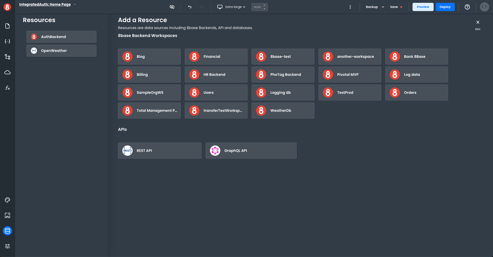
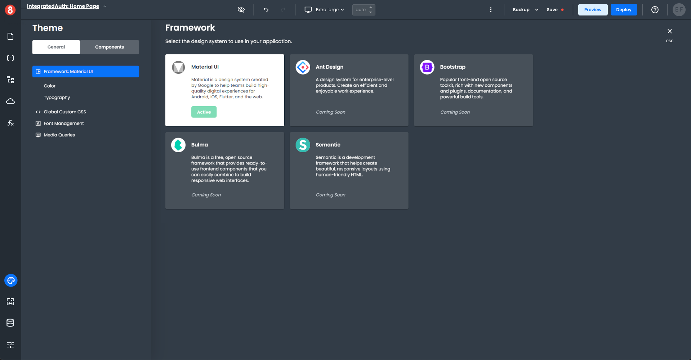

# Building Full-stack Go-to-Market Apps

Learn how App Builder allows the development of go-to-market applications across all industry verticles – like finance, health-care, social networks, software as a service (SaaS) and others.

_______

## How App Builder Works

App Builder lets you quickly build, deploy, and continue to evolve both customer-facing and internal tools using an intuitive UI and JavaScript when needed. Also, App Builder is a full-stack application development tool that allows connectivity with any backend, including 8base workspaces, which include a database, API, roles & permissions, and serverless capabilities. This doesn't preclude you from connecting to other data sources, as requests to REST and GraphQL APIs are also supported.

To best explain how go-to-market apps can get developed using App Builder, we believe it's essential to give you an overview/walk through of the standard App Builder development experience. Along the way, we'll be highlighting many of the core features and capabilities of App Builder that make it a highly dynamic and flexible tool.

### 1. Creating your first App Builder Workspace

Creating an App Builder project is as simple as giving your project a name and clicking create! App Builder will handle the provisioning of all the resources required for your full-stack web application. At that point, developers can dive into either the frontend or backend tools to start developing the application.

Once created, a workspace card will appear in your developer home area, through which you can access the App Builder Editor for your project.

*For more information on 8base's backend tools, visit the [backend docs](../backend/readme.md)*

### 2. Using Drag-and-Drop Components to Build Pages in Apps

App Pages get built using drag-and-drop components inside the App Builder Editor. App Builder's Component Library includes many feature-packed Components, like Input Control, Switch, File Upload, Accordion, Layout Controls such as Card and Async Control, and many more. Plus, we provide State Mangement, Assets, and Navigation. Developers drag and drop components onto the page canvas before working on the three available configuration areas of any component; Component Properties, Component Styles, and Component Events.

• **Component Properties**: The data inputs, attributes, and behavior of a component instance.

• **Component Styles**: The visual styling configuration of a component instance.

• **Component Events**: The event listeners associated with a component instance that trigger actions.

### 3. Connecting to Data Sources and APIs

#### Adding Resources
Resources are the connections of your Frontend workspace connected to a Backend. The left-hand *Resources* pane lists all your connected resources. The right-hand *Add a Resource* pane lists all the available resources.

To add a new 8base Backend connection, click on the name of the 8base resource in the right-hand pane. The new resource will automatically be added to your connected resource list.

To modify the connection properties of your new resource, click on the name, which will bring up the connection properties window. Edit the connection details as needed and save your changes.

You can also integrate with a Rest API or GraphQL API. Click on the appropriate icon in the *Add a Resource* pane, fill out the connection property details, and save it. The new API resource will be added to your connected resource list.

#### Requests
Requests made to data sources are reusable elements it your App Builder project, allowing you to effectively organize your and optimize projects when collaborating with teams, as well as working by yourself. Meanwhile, the response data received from Requests gets stored in App Builder's State Management system, making it accessible to Components, Functions, and other App Builder elements.

### 4. Customizing the Look and Feel of Applications

App Builder applications get styled at the global, component default, and component instance levels. These several levels of styling separation allow for fine-grained customization of the look and feel of applications, using both form-based styling options and pure CSS code. 

• **Global Styling**: The global CSS that defines an application's look and feel (i.e., Material Design,  Typography, custom CSS)

• **Component Default Styling**: The default appearance of a component when it's first dropped onto the canvas, overriding any global style rules.

• **Component Instance Styling**: The appearance of a single component instance configured by the developer, overriding any global style and component default style rules. 

### 5. Setting up User Authentication

User Authentication (Docs coming soon...)

### 6. Deploying Applications and Custom Domains

Once an application is ready for deployment, the deploy button is available in the editor's nav bar! The deploy button triggers a process that generates a React.js application, runs the `build` command, and deploys the compiled code to an S3 bucket. 

8base automatically assigns a version number to every deployment to which the project can get restored if needed. A deployed app will quickly become available at an 8base-generated public URL (`<project-id>.appbuilder.8base.com`). However, you are free to create a mapping with your DNS provider to point a custom domain to this endpoint.

### 7. Continuous Development

Changes made in the App Builder Editor do not affect deployed applications. Meaning that while users rely on a stable version of the deployed app, you and your team can safely make changes and update features in the Editor. There isn't any need to deploy new features and capabilities until they're fully stable and ready for prime time! The "Save" and "Backup" buttons allow you to commit/restore your work when developing.

Currently, App Builder supports 1-developer using the Editor at a time. However, 8base is quickly working towards enabling multi-developer collaboration in front-end projects.

## Full-stack Go-to-Market Apps

The steps detailed above are the most common steps taken during an App Builder app's lifecycle, from creating a new project to deployment and continuous development. Within each stage, core App Builder capabilities were highlighted, such as multi-level custom styling, state management, 3rd party API connectivity, backend data storage with an API, deployment, and more. These capabilities provide the building blocks for modern application development – the fundamental ones and beyond.

Thanks to the "Building Block" approach, App Builder is well suited for any web application development project - as opposed to being only applicable for a specific vertical, like eCommerce or Blogs. Meanwhile, for projects in regulated industries with high-security requirements (HIPAA, SOC2, other), our team can work with you directly to properly configure the working environments to meet these compliance standards.