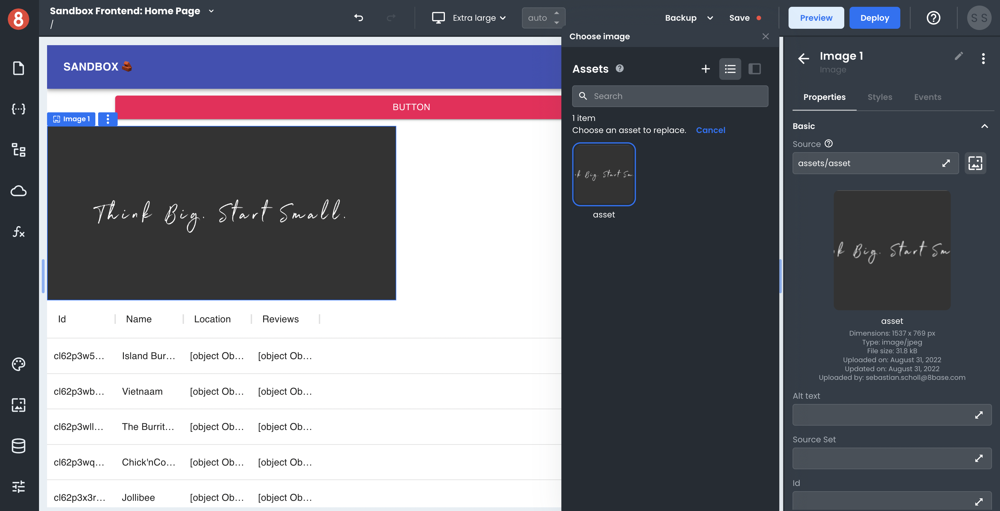

# Displaying an Image or File on a Page

This article describes how developers can display an Asset on a page.
___

When you want to display an image or file on a page in App Builder, you can use the Image (App Builder correctly only supports Images). 

## Image Component

The Image component will display images that have been uploaded to App Builder or one hosted elsewhere using a source URL. To add an Image component to your page, select it from the Components toolbox on the left side of the App Builder canvas and drag and drop it onto the page.

Once you've added an Image component to your page, you can configure its properties in the Properties panel on the right side of the App Builder canvas. 

The "Picture Icon" button that's next to the Source attribute in the Properties panel will open the Select Asset dialog. In this dialog, you can select an image that's already been uploaded to App Builder or specify a URL for an image hosted elsewhere. 

The specified Asset will be rendered in the Component.
