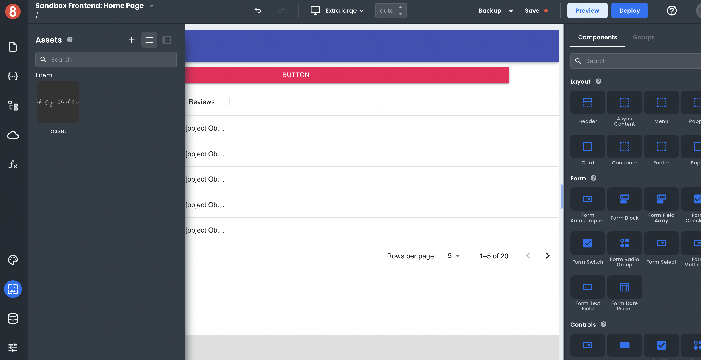

# Introduction

This article describes how developers handle _Static Assets_ in App Builder

---

When you build an app, there are often times when you need to include images or other files. App Builder makes it easy to upload these static assets and use them in your app.

_Static Assets_ in web applications refer to images, JavaScript, CSS, or other files that are not changed by the user or the server. They are often used for logos, icons, and background images.

In App Builder, JavaScript and CSS are managed and stored in _Functions_ and _Themes_, as well as some other locations. Therefore, static assets in App Builder refer only to images and other file types.
