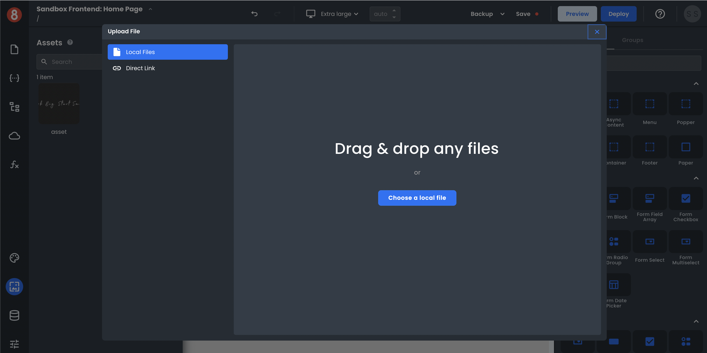

# Uploading an Image or File

This article describes how developers upload images and files as static assets in App Builder

---

When working on a project in App Builder, you may need to include some images or other files. For example, you might want to add an image to your app's home screen or upload a file that your app will use.

App Builder makes it easy to upload images and files. To upload an image or file:

1. In App Builder, Click the Assets tab.
2. Click the Upload button.
3. Select the image or file you want to upload (Direct Upload or Link).
4. Click Open.

The image or file will be uploaded to your project and available in your Asset Library. You can then use it in your app.

## Next

Now that you've uploaded your image or file, we'll cover how to add it to a page in the following document.
