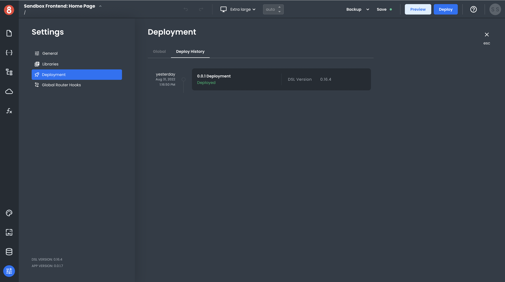

# Seeing Deployment History

This article describes how developers view their deployment history.

---

When you build an app and deploy it, you'll see a new entry in the "Deployment History" section of the "Settings > Deployment > Deployment History" tab. This will show you when your app was deployed, the version number, and the deployment success status.

