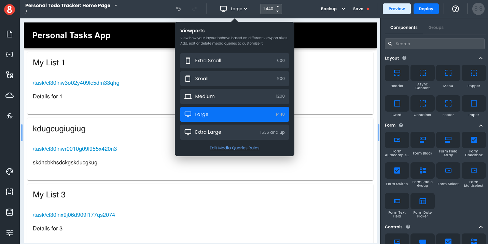

# Setting a Desktop Viewport

Select the "Large" Viewport option to set a desktop viewport option or drag the Viewport slider to anything above 1000px wide. Given that responsive design aims to accommodate many device types and screen sizes, as opposed to a single device, we recommend moving the slider around during development so that you're considering the different sizes of desktops.

To find the exact width of a targeted device, we recommend using [ScreenSize.es](https://screensiz.es/).