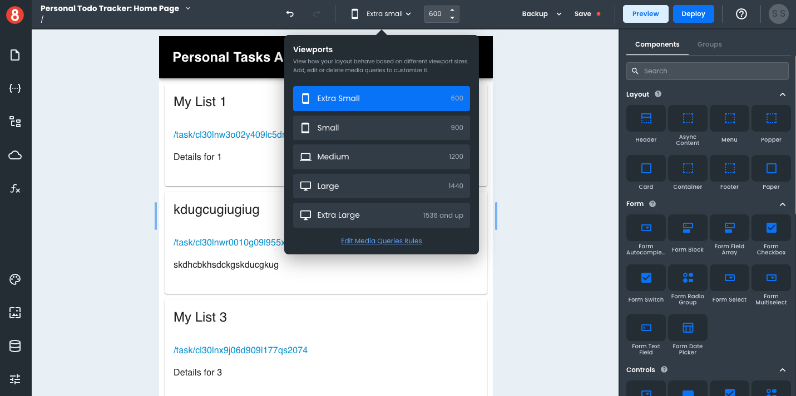

# Setting a Mobile Viewport

To set a mobile viewport, you can either select the "X-Small" Viewport option or drag the Viewport slider to anything below 800px wide. Given that responsive design aims to accommodate many device types and screen sizes, as opposed to a single device, we recommend moving the slider around during development so that you're considering different size mobile devices.

To find the exact width of a targeted device, we recommend using [ScreenSize.es](https://screensiz.es/).
