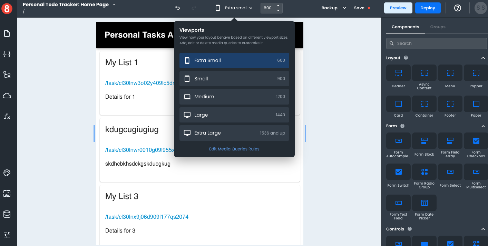

# Changing the Viewport

This article describes how developers can change the viewport in App Builder to support different screen widths.

___

When creating applications, it is essential to consider how your app will look on devices with different screen widths. App Builder allows you to change the viewport to optimize your app for different devices.

To change the viewport:

1. In App Builder, click on the 'View Port Size' dropdown in the top menu.
2. Select the viewport size that you want to use.

Note that you can manually adjust the viewport width using drag bars on either side of the Page Canvas.

## Media Queries vs. Viewport

It's important to note the difference between media queries and viewports. Media queries are used to apply different styling rules to your app based on different conditions, such as screen width. Viewport, on the other hand, is used to simply see your app's appearance when adjusting to different screen widths and ratios. 

When working in App Builder, you have 5 default viewport configurations and can manually adjust the page canvas to custom screen widths.
