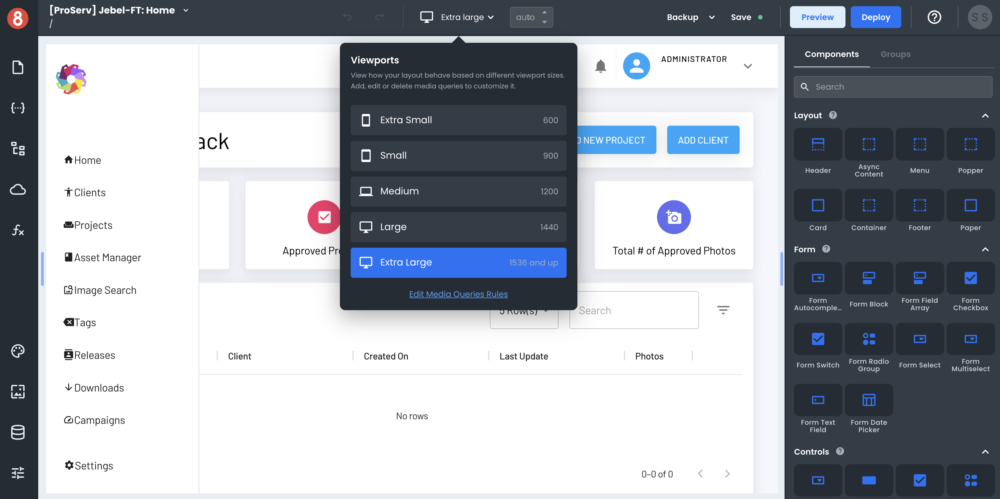

# Responsive Design Introduction

This document describes how responsive design works in App Builder.

Responsive design is a term that is used to describe a website or web application that can adapt its layout to the size of the device it is being viewed on. This means that whether you are viewing a website on a desktop computer, laptop, tablet, or smartphone, the content will be automatically adjusted to fit the screen size.

This is in contrast to traditional web design, where the layout is fixed and does not change regardless of the device being used.

Responsive design has become increasingly important in recent years as the number of people using mobile devices to access the internet has grown. 

## Responsive Design Using Media Queries

App Builder enables developers with tools to address responsive design to make sure that your app looks great on all devices. It does this by letting developers define different media queries that will be used to change the layout of the app depending on the size of the screen.

Media queries are a CSS3 feature that allows developers to target specific styles at specific screen sizes. This means that you can have different styles for different devices, and even different styles for different Orientations (landscape or portrait).

App Builder provides both a visual interface for working with media queries, as well as a code editor for CSS.

When you are developing your app, you can preview how it will look on different devices by using the Viewports feature. This lets you see how your app will look on different screen sizes and orientations, and test out different media queries. 

In the following responsive design sections, we will take a look at how you can use media queries in App Builder to create responsive apps.

