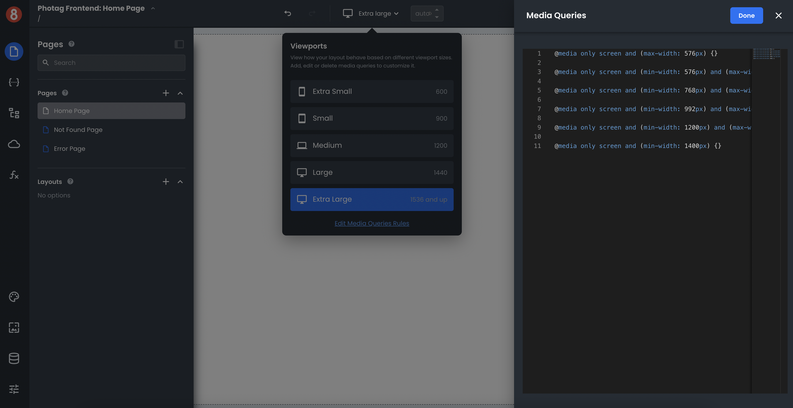

# Managing media query definitions

This document describes how a developer can manage media query definitions in App Builder.

When using App Builder to theme an application, a developer can take advantage of media queries to change the look and feel of their application based on different screen sizes. For example, a developer could use a media query to make their application more responsive on mobile devices by rearranging elements or changing font sizes.

## Adding and Managing Media Query Definitions

App Builder provides a media query manager that makes it easy to create and edit media queries. To access the media query manager, open the Theme editor and click on the "Media Queries" tab in the nested left menu.

The media query manager will list all existing media queries for the currently selected theme. From here, a developer can add new media queries or edit existing ones. Just click on the "Add Media Query" or edit Icon buttons next to a media query to get started.

