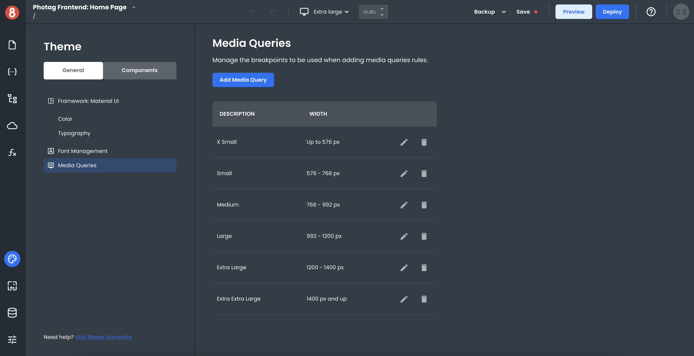
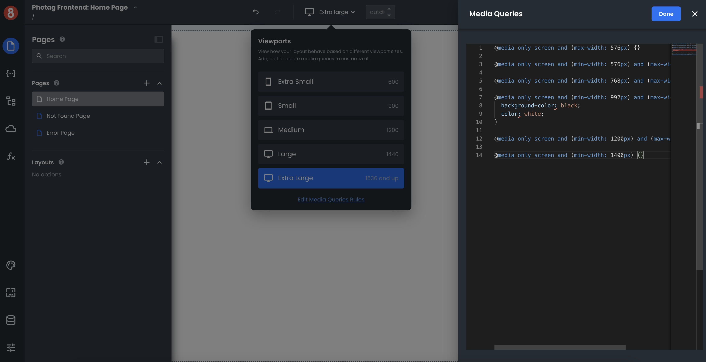
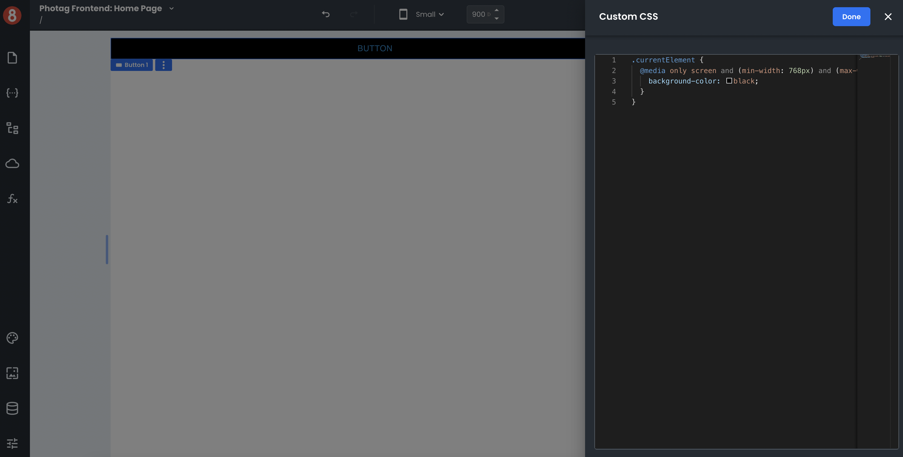

# Writing custom media query rules
This document describes how a developer can write custom CSS rules inside media queries.

App Builder provides a graphical interface for managing media query definitions. A media query definition consists of a name, breakpoints, and zero or more CSS rules. The name is used to identify the media query definition within App Builder; the CSS rules are applied only when the specified media conditions are met. 

## How Media Queries Work

Media Queries check the user's media type, which the user agent sets. The most common media types are "screen" and "print." If the user agent doesn't recognize the media type, it will default to "screen." 

Media queries can be used to check for a specific feature of the user agent, such as the viewport's width or the device's height. For example, you could use a media query to target only users with a screen width between 320 and 480 pixels.

When a device's screen width is within a specified range set by the media query, all CSS rules associated with that query will be applied to the document. The CSS rules will not be used if the screen width falls outside that range.

## Adding CSS Rules to Media Queries 

They represent the most commonly used breakpoints for responsive design. You're able to edit them, use them, or delete them! App Builder ships with some different default media queries for you to use.

To add CSS rules to a media query, click on the Viewport selector in the top nav of the Editor. You'll see a link at the bottom of your list titled "Edit Media Queries Rules." Clicking it will open a CSS editor, allowing you to add CSS rules to your media queries.

:::info
Note that Media Queries are global. When they are active, the rules they toggle will be applied across your entire application.
:::

## Component Level Media Queries

While App Builder provides an interface for managing media queries and breakpoints at the application's global level, developers can still leverage media queries at the component level in "Custom CSS" input.

Leveraging media queries at the component level will override any global media query settings and allow for more granular control over how responsive design is handled on **that specific component instance**. 
