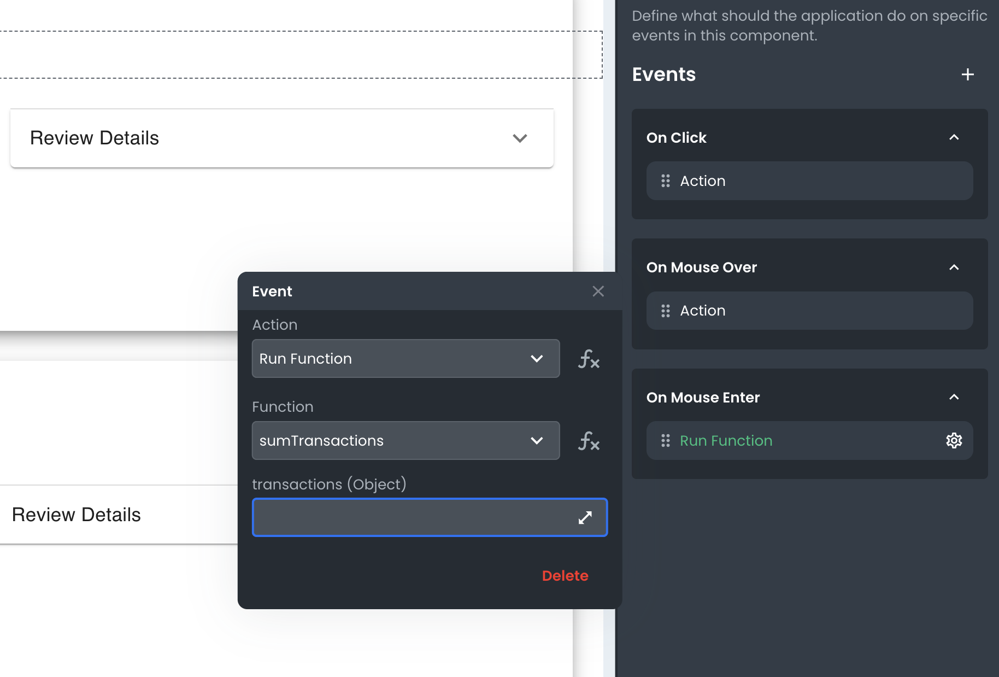
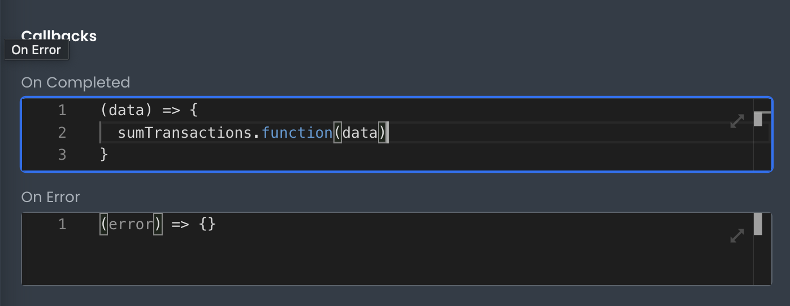

# Specifying Events in Editor

This article describes how developers can specify events in the App Builder editor.

---

There are two areas where you can specify Events in App Builder; Components and Requests.

## Specifying Events on Components

When you add a Component to your app, you can specify Events that will be triggered when the component is interacted with. To do this, open the Events tab on the right-hand side of the App Builder editor.

The Events tab will list all of the events that are available for that particular component. For example, the Button component has events for when it is clicked, hovered over, or pressed.

To add an Event, click the event you want to trigger. This will create an Action for it which you can then customize. Actions can be configured currently to:

- Navigate
- Run a Request
- Run a Function
- Run Custom Code

## Specifying Events on Requests

Requests also have a similar Events tab that you can use to specify what should happen when the Request is completed; On Error and On Completed.

Unlike Component level events, these only allow for custom code to be written. That said, inside the code editor for the event, you're able to programmatically perform any of the 4 options:

- Navigate
- Run a Request
- Run a Function
- Run Custom Code

## Conclusion

By specifying Events on your Components and Requests, you can fine-tune the behavior of your app to create a better user experience. The App Builder makes it easy to specify these events with its visual interface and code editor.
